# 12EN12 · Guía completa de la aplicación

Documento de referencia de **todo** lo que hay en la app: cada pantalla, cada botón, cada
regla de negocio y cada cruce entre lo que hace un cliente y lo que ve el equipo.

Está ordenado como se usa la app de verdad: primero el recorrido de un cliente desde que
llega sin conocerte hasta que renueva a las 12 semanas, después el recorrido del equipo, y
al final los motores que hay por debajo y las cosas que conviene saber.

- **Generado**: 3 de agosto de 2026, a partir del código real (no de la memoria de nadie).
- **Ampliado** el mismo día con las reglas de los motores: el orden exacto del cálculo de
  macros (4.1), el reparto entre comidas con sus tablas completas (4.3) y cómo la app busca
  y elige alimentos (4.4).
- **Capturas**: en `capturas/`, tomadas de la app funcionando con el cliente y el admin de
  prueba. Las de móvil son de un viewport real de 390x844, no una ventana encogida.
- **Cifras del sistema**: 31 rutas de pantalla, 28 páginas, 194 endpoints de API repartidos
  en 19 routers, y 27 componentes solo en la pestaña de Nutrición.

---

## Índice

**Parte 0 · Lo básico**
- [0.1 Qué es la app](#01-qué-es-la-app)
- [0.2 Los tres roles](#02-los-tres-roles)
- [0.3 Los planes y qué desbloquea cada uno](#03-los-planes-y-qué-desbloquea-cada-uno)

**Parte 1 · El recorrido del cliente**
- [1.1 El test de nivel (antes de comprar)](#11-el-test-de-nivel--test)
- [1.2 Registro y acceso](#12-registro-y-acceso--auth)
- [1.3 Elegir plan](#13-elegir-plan--planes)
- [1.4 El pago y el arranque en lunes](#14-el-pago-y-el-arranque-en-lunes)
- [1.5 El cuestionario, sus cuatro niveles](#15-el-cuestionario-sus-cuatro-niveles--questionnaire)
- [1.6 Bienvenida](#16-bienvenida--welcome)
- [1.7 El panel del cliente](#17-el-panel-del-cliente--dashboard)
- [1.8 Nutrición](#18-nutrición--dashboardnutrition)
- [1.9 El asistente de IA](#19-el-asistente-de-ia--dashboardchatbot)
- [1.10 Alimentos](#110-alimentos--dashboardfoods)
- [1.11 Ajustar macros](#111-ajustar-macros--dashboardmacro-calculator)
- [1.12 Suplementos](#112-suplementos--dashboardsupplements)
- [1.13 Check-ins](#113-check-ins--dashboardcheckins)
- [1.14 Reportes y el informe mensual](#114-reportes-y-el-informe-mensual--dashboardreports)
- [1.15 Chat](#115-chat--dashboardmessages)
- [1.16 Mi perfil](#116-mi-perfil--dashboardprofile)
- [1.17 La renovación de la semana 12](#117-la-renovación-de-la-semana-12--renovacion)
- [1.18 Rutina (hoy oculta)](#118-rutina-hoy-oculta)

**Parte 2 · El recorrido del equipo**
- [2.1 El panel de control](#21-el-panel-de-control--admin)
- [2.2 La ficha de un cliente](#22-la-ficha-de-un-cliente--adminclientsid)
- [2.3 Clientes, usuarios y permisos](#23-clientes-usuarios-y-permisos)
- [2.4 Leads (CRM)](#24-leads-crm--adminleads)
- [2.5 Mensajes](#25-mensajes--adminmessages)
- [2.6 Planes](#26-planes--adminplanes)
- [2.7 Menús, alimentos y suplementos](#27-menús-alimentos-y-suplementos)
- [2.8 Rutinas](#28-rutinas--adminroutines)

**Parte 3 · Dónde se cruzan**
- [3.1 Tabla de interacciones cliente ↔ equipo](#31-tabla-de-interacciones-cliente--equipo)
- [3.2 Notificaciones, una por una](#32-notificaciones-una-por-una)

**Parte 4 · Los motores**
- [4.1 Cómo se calculan los macros](#41-cómo-se-calculan-los-macros)
- [4.2 Cómo se cuentan los alimentos](#42-cómo-se-cuentan-los-alimentos)
- [4.3 El reparto entre comidas](#43-el-reparto-entre-comidas)
- [4.4 Cómo la app busca y elige alimentos](#44-cómo-la-app-busca-y-elige-alimentos)
- [4.5 Cobros con Stripe](#45-cobros-con-stripe)
- [4.6 El PDF](#46-el-pdf)

**Parte 5 · Lo que conviene saber**
- [5.1 Funcionalidad apagada a propósito](#51-funcionalidad-apagada-a-propósito)
- [5.2 Huecos reales](#52-huecos-reales)
- [5.3 Cosas que confunden](#53-cosas-que-confunden)

**Anexos**
- [A. Mapa de rutas](#anexo-a--mapa-de-rutas)
- [B. Índice de capturas](#anexo-b--índice-de-capturas)

---

# Parte 0 · Lo básico

## 0.1 Qué es la app

12EN12 es la aplicación del método. Un cliente entra, contesta unas
preguntas, y el sistema le calcula **cuánta proteína, cuántos hidratos y cuánta grasa**
tiene que comer cada día, distinguiendo días de entreno de días de descanso. A partir de
ahí monta sus comidas, registra lo que come, manda reportes cada dos o cuatro semanas, y
recibe un informe con lo que ha cambiado.

Lo que la diferencia de un contador de calorías corriente es que **no cuenta todo lo que
lleva un alimento**: aplica las reglas del método (ver [4.2](#42-cómo-se-cuentan-los-alimentos)),
que deciden qué macros cuentan de verdad en cada alimento.

## 0.2 Los tres roles

| Rol | Quién es | Qué ve |
|---|---|---|
| `client` | El cliente que paga | Su panel, su dieta, sus reportes. Nada de otros clientes |
| `trainer` | Un coach del equipo | El panel de administración completo, **todos** los clientes, menos la pestaña de Usuarios |
| `admin` | Jesús y quien él decida | Todo, incluida la gestión de usuarios y roles |

**Decisión importante del 21-07-2026**: los `trainer` ven y gestionan **todos** los
clientes, no solo los suyos. La única restricción real es que un trainer no puede quitarle
un cliente a otro coach (solo puede asignarse clientes que no tengan coach), y que la
pestaña **Usuarios** es exclusiva de `admin`.

## 0.3 Los planes y qué desbloquea cada uno

Los precios y las capacidades salen de un catálogo único en el código
(`backend/models/user.py`, `PLAN_CATALOG`), que el admin puede retocar desde el panel.

### Planes que se venden hoy

| | Nivel 1 | Nivel 2 | Nivel 3 | Membresía |
|---|---|---|---|---|
| **Precio** | 297 € | 897 € | 1.497 € | 97 €/mes |
| **Ciclo** | 12 semanas | 12 semanas | 12 semanas | Mensual |
| **Cómo se compra** | Tarjeta | Tarjeta | **Por llamada** | Solo como salida |
| **Calculadora** | Autogestión | Personalizada (coach) | Personalizada (coach) | Autogestión |
| **Reportes** | Mensual | Quincenal + mensual | Quincenal + mensual | Ninguno |
| **Rutina** | No | Personalizada | Personalizada | No |
| **Suplementación** | No | Sí | Sí | No |
| **Acompañamiento** | Solo app | Con entrenador | Con entrenador y llamadas | Solo app |
| **Contacto** | — | Quincenal | Semanal | — |

**El Nivel 3 no lleva botón de pago.** Ni en el test de nivel ni en la pantalla de planes.
El motivo está escrito en el propio código: cobrar 1.497 € sin hablar antes con la persona
no es lo que se quiere. En su lugar se le pide nombre y teléfono, y salta un aviso en el
panel del equipo.

**La Membresía no se ofrece al comprar.** Está marcada `solo_salida`: solo aparece como
destino de quien no renueva su ciclo. Es "te quedas con la app y tus datos por 97 € al mes".

### Planes antiguos (legacy)

`elm`, `reto12en12_gold`, `reto12en12_silver`, `reto60`, `calculadora_jp`, `mantenimiento`,
`gold`, `silver`, `bronze`. **Se respetan a quien ya los tiene** y siguen funcionando con
todas sus capacidades, pero no se pueden contratar de nuevo. Cuando a uno de estos clientes
le toca renovar, elige entre los tres niveles actuales.

Hay además dos **especiales** (`premium`, `plan_6m`, pactados con el CEO, cobro manual) y
dos **complementos** (`rutina_mes`, `formaciones`, compra suelta, no son membresía).

---

# Parte 1 · El recorrido del cliente

## 1.1 El test de nivel · `/test`

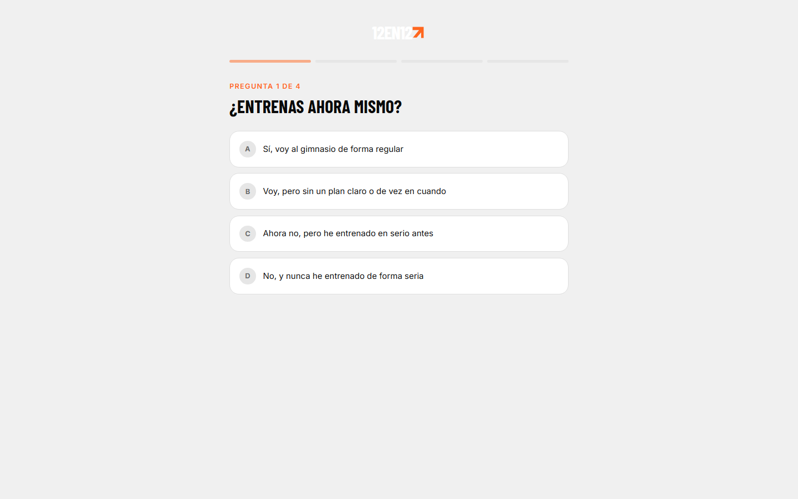

**Es la única pantalla pública de la app**: no hace falta cuenta, ni sesión, ni dar el
correo. Esa es una decisión cerrada: pedirle el correo para enseñarle lo que acaba de
contestar es justo lo que hace que la gente cierre la pestaña.

**Cuatro preguntas, una por pantalla**, con barra de progreso y botón "Atrás":

1. **¿Entrenas ahora mismo?** — A: Sí, voy al gimnasio de forma regular · B: Voy, pero sin
   un plan claro o de vez en cuando · C: Ahora no, pero he entrenado en serio antes ·
   D: No, y nunca he entrenado de forma seria
2. **¿Has llegado alguna vez a verte como querías?** — A: No, nunca · B: Llegué a verme
   bien, pero no supe mantenerlo · C: Sí, y quiero recuperar aquello · D: Estoy bien ahora,
   quiero afinar más
3. **Cuando has intentado cuidarte, ¿qué es lo que más te ha costado?** — A: No saber si lo
   estaba haciendo bien · B: Que la dieta no encajaba con mi vida · C: Empezar. Sé lo que
   hay que hacer, pero no arranco · D: Mantenerlo más de unas semanas
4. **¿Cuánto tiempo llevas intentándolo?** — A: Menos de un año · B: De 1 a 5 años ·
   C: Más de 5 años · D: Toda la vida

**Qué nivel recomienda cada combinación** (la pregunta 4 se guarda pero hoy no decide):

| Si... | Recomienda | Por qué se le dice |
|---|---|---|
| 1D (nunca ha entrenado en serio) | **Nivel 3** | "Empezar de cero solo, con la información que hay por ahí, es la forma más rápida de acabar dejándolo" |
| 1B + 2A (va sin plan y nunca se ha visto bien) | **Nivel 3** | "No es cuestión de esfuerzo: te falta que alguien ordene el trabajo" |
| 3C (lo que le cuesta es arrancar) | **Nivel 3** | "Para eso hace falta alguien detrás, no otro PDF" |
| 1A + 2A/2B + 3A | **Nivel 2** | "Lo que te falta es saber si vas bien" |
| 1C + 2B + 3D | **Nivel 2** | "Lo que falla es sostenerlo" |
| 1A + 2D + 3B | **Nivel 1** | "Entrenas, estás bien y solo quieres afinar" |
| 1A + 2C + 3B | **Nivel 1** | "Necesitas una herramienta que te cuadre la comida" |
| **Cualquier otra cosa** | **Nivel 2** | El intermedio |

Si encajan varias reglas a la vez, **gana el nivel mayor**.

> **Nota de criterio**: que "cualquier otra cosa" caiga en el Nivel 2 es una decisión de
> desarrollo, no del documento de Jesús. La tabla no cubre las 256 combinaciones posibles y
> recomendar el Nivel 3 a todo el que se sale de ella sería ponerle 1.497 € delante a
> alguien que quizá solo necesita que la dieta le encaje. Se cambia en una línea
> (`NIVEL_POR_DEFECTO` en `backend/core/quiz_venta.py`).

**La pantalla de resultado** muestra el nivel recomendado en grande con el porqué en las
palabras de Jesús, y **los otros dos debajo, elegibles**. La recomendación orienta, no
encierra.

- Nivel 1 o 2 → "Empezar" → guarda la elección y lleva al registro
- Nivel 3 → "Agendar una llamada" → pide **nombre y teléfono** (ambos obligatorios) y crea
  un lead marcado "PIDE LLAMADA"
- Debajo, siempre: "Guardar este resultado para más tarde", que pide solo el correo

Al pie, fijo: *"Todos los ciclos son de 12 semanas. Tu precio se congela mientras no te des
de baja."*

**Lo que ve el equipo**: el lead entra en el CRM (`source: web`) con la nota
*"Test de nivel: sale nivel3. PIDE LLAMADA (Nivel 3)."*, y si pidió llamada aparece
arriba del todo en el panel de control (ver [2.1](#21-el-panel-de-control--admin)).

## 1.2 Registro y acceso · `/auth`

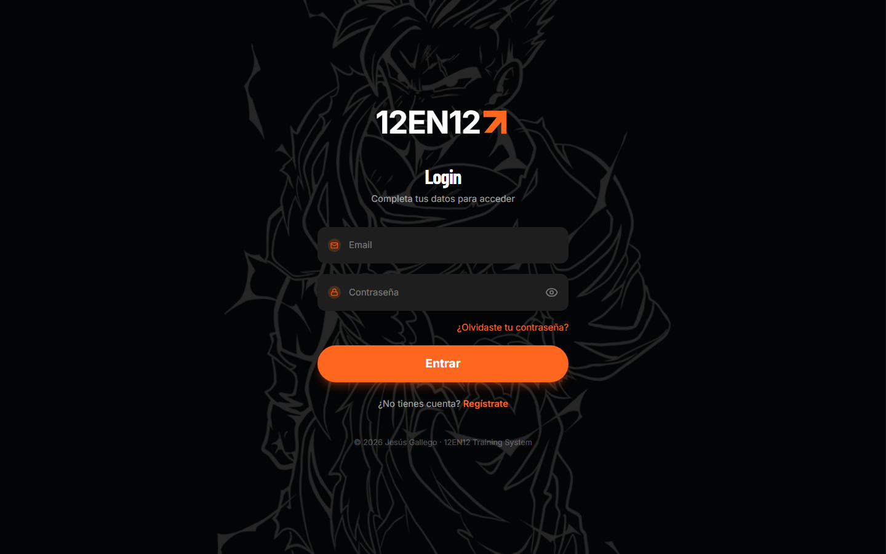

Una sola pantalla con dos modos.

**Registro**: nombre completo, teléfono, email y contraseña (mínimo 6 caracteres). El
teléfono se pide aquí a propósito, para que el cuestionario de macros solo pregunte lo que
necesita para calcular.

**Entrar**: email y contraseña, con botón de ojo para verla.

**No hay recuperación de contraseña automática.** El enlace "¿Olvidaste tu contraseña?"
muestra: *"Escribe a tu entrenador por WhatsApp y te generará una contraseña nueva en un
minuto"*. El equipo la genera desde el panel de Usuarios.

Detalles del acceso:
- Si el email ya existe: *"Email ya registrado"*
- Si las credenciales fallan: siempre *"Credenciales inválidas"*, tanto si el correo no
  existe como si la contraseña es incorrecta. Es deliberado: así no se puede averiguar qué
  correos están dados de alta
- Si la cuenta está dada de baja: *"Cuenta desactivada. Contacta con tu entrenador."*
- **Clientes migrados de Calma**: si la contraseña no coincide con el hash actual, se
  prueba el hash antiguo de Firebase; si acierta, se migra al vuelo sin que el cliente note
  nada

Registrarse **no crea todavía una ficha de cliente**: eso ocurre al iniciar el pago.

## 1.3 Elegir plan · `/planes`

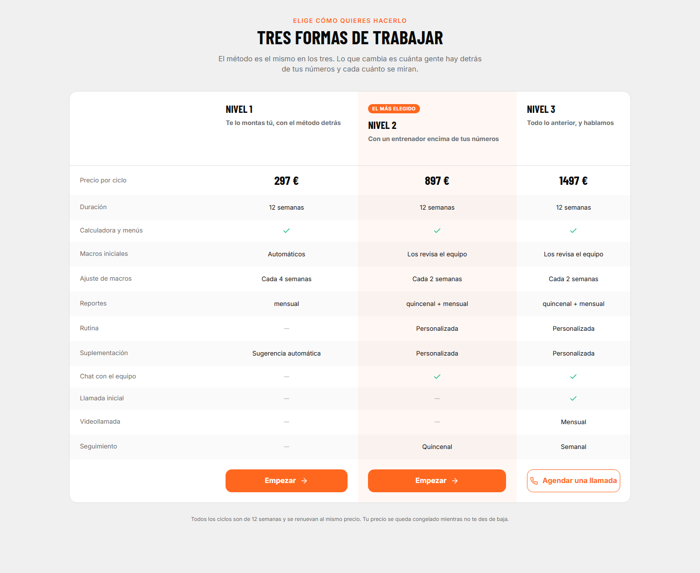

Cabecera: *"Elige cómo quieres hacerlo · Tres formas de trabajar · El método es el mismo en
los tres. Lo que cambia es cuánta gente hay detrás de tus números y cada cuánto se miran."*

**En escritorio** es una tabla comparativa de tres columnas, fila a fila: Duración,
Calculadora, Macros iniciales, Ajuste de macros, Reportes, Rutina, Suplementación, Chat,
Llamada inicial, Videollamada y Seguimiento. La columna del Nivel 2 lleva el badge
**"El más elegido"**.

**En móvil** son tres tarjetas apiladas con los mismos datos.

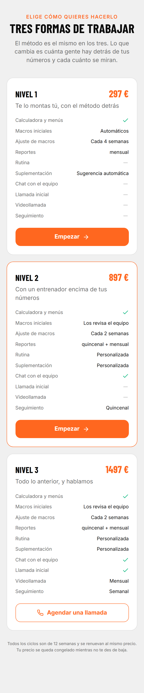

Los textos comerciales ("Te lo montas tú, con el método detrás", "Con un entrenador encima
de tus números", "Todo lo anterior, y hablamos") están escritos en la pantalla; todo lo
demás (nombre, precio, ciclo, qué incluye) sale del catálogo, así que si el admin cambia un
plan, esta pantalla cambia sola.

**Los botones**:
- Su plan actual → caja gris "Tu plan actual", no pulsable
- Nivel 1 y 2 → "Empezar" → Stripe
- Nivel 3 → "Agendar una llamada" → lleva al chat con el equipo

Al pie: *"Todos los ciclos son de 12 semanas y se renuevan al mismo precio. Tu precio se
queda congelado mientras no te des de baja."*

> `/onboarding` era la pantalla vieja de planes. Hoy **redirige aquí**. Se unificó el
> 3-08-2026 porque listaba cualquier plan activo con precio y había acabado ofreciendo el
> Nivel 3 con botón de pago, saltándose la regla de la llamada.

## 1.4 El pago y el arranque en lunes

Al pulsar "Empezar" se crea una sesión de pago en Stripe y el navegador sale de la app.
Antes de eso pasan varias cosas:

1. Se comprueba que el plan **sigue a la venta** (los legacy dan
   *"Este plan ya no está disponible para nuevas contrataciones"*)
2. Se crea la ficha de cliente en estado `pendiente_pago`
3. Si el cliente ya tiene una suscripción viva, se rechaza
4. **Si compró una revisión suelta hace menos de 30 días, se le descuenta** con un cupón de
   un solo uso por el importe exacto

### El arranque en lunes

**Todos los clientes arrancan en lunes, paguen el día que paguen.** No es una preferencia:
permite dimensionar el trabajo de la semana y, sobre todo, que el cobro llegue **antes** de
preparar el ciclo siguiente. Si alguien no renueva, no se prepara nada y no se trabaja en
balde.

- Se cobra el ciclo completo el día del pago
- La suscripción se ancla al lunes de arranque (`billing_cycle_anchor`), así el segundo
  cobro cae el día que termina su ciclo real
- Los días entre el pago y el lunes (la "Semana 0") **se regalan**, no se prorratean

**La regla de las 48 horas**: si al pagar quedan menos de 48 horas para el lunes más
próximo, el arranque salta al lunes siguiente. En los Niveles 2 y 3 el equipo necesita esas
48 horas para validar los macros antes de que arranque el programa.

Mensaje que recibe: *"Tu programa arranca el lunes {día} de {mes}. Hasta entonces, ve
preparándolo todo: saca tus macros, hazte tus fotos y monta tus primeras dietas."*

### El precio congelado

Al comprar se guarda el precio pagado. **Mientras no se dé de baja, si renueva en el mismo
plan paga ese precio aunque el catálogo haya subido.** Si cambia de plan, paga el del plan
nuevo. Stripe ya lo respeta de forma nativa; se guarda además para poder enseñárselo y para
detectar si alguien recrea la suscripción por error.

### La vuelta del pago

Al volver, la app **confirma el pago de forma inmediata** en vez de esperar al webhook (que
puede tardar o perderse), refresca el perfil y muestra *"¡Pago confirmado! Tu plan está
activo"*. Si se cancela: *"Pago cancelado. Puedes elegir un plan cuando quieras."*

## 1.5 El cuestionario, sus cuatro niveles · `/questionnaire`

En cuanto el pago se confirma, la app **obliga** a pasar por aquí: mientras el cuestionario
inicial no esté hecho, cualquier intento de entrar al panel redirige a esta pantalla.

Son cuatro flujos distintos en la misma pantalla.

### Nivel 0 · El alta (4 preguntas, obligatorio)

El objetivo es que salga con **macros provisionales y la app usable el mismo día**. Todo lo
demás espera.

1. Portada: *"Empecemos · Cuatro preguntas y tienes tus macros. Un minuto."*
2. **Sexo**: Hombre / Mujer
3. **Objetivo**: *"Quiero ganar Masa Muscular (VOLUMEN)"* / *"Quiero perder Grasa
   (DEFINICIÓN)"*, con el aviso *"Las dos a la vez, NO. Piensa, prioriza y elige."*
4. **Confirmación**: *"¿Estás seguro?"* — "Sí, lo tengo claro" / "No, en realidad quiero lo
   otro" (invierte el objetivo)
5. **Peso**: *"Pésate siempre igual: en ayunas, sin ropa y después de ir al baño."*
6. **% de grasa**: un carrusel horizontal con 22 fotos de referencia (del 50 % al 8 %, de 2
   en 2), arrastrable, con la opción de subir una foto propia que se fija en el centro
7. Cierre → "Calcular mis macros"
8. **Resultado**: tres bloques (día de entreno, perientreno, día de descanso) con el
   desglose de por qué han salido esos números

Nombre y teléfono no se piden: ya vienen del registro.

**Este cuestionario no se puede repetir.** Si se intenta, la pantalla dice *"Ya completaste
el cuestionario inicial"*.

### Nivel de ajuste · Afinar los macros (opcional pero recomendado, repetible)

Aquí sí se puede volver las veces que haga falta: si cambia de trabajo o empieza otro
deporte, lo vuelve a pasar.

Con **los macros actualizándose en vivo** en la cabecera a cada respuesta:

1. **Actividad diaria fuera del gimnasio**: Sedentario / Normal / Muy activo
2. **¿Practicas otro deporte?**: Sí / No
3. **Facilidad para engordar**: Enseguida / Normal / Casi no
4. **¿Te cuesta definir?**: Mucho / Normal / Poco *(se guarda, no mueve macros)*
5. **¿Sigues una dieta ahora y sabes lo que comes?**: Sí / No
6. Si sigue dieta: **cuánto tiempo**, **cómo le está funcionando**, **hambre o saturación**
7. Si sigue dieta: **contar la dieta real**, por tres puertas —
   **escribirla** (texto libre), **un día mío** (elige uno de sus días ya montados en la
   calculadora) o **una foto** (máx. 8 MB). El sistema la lee y responde: *"He entendido
   que estás comiendo X g de hidratos, Y g de proteína y Z g de grasa. ¿Es correcto?"* con
   los alimentos reconocidos y los no reconocidos en ámbar. Botones "Sí, es correcto" /
   "No, corregir"

Efecto de cada respuesta en [4.1](#41-cómo-se-calculan-los-macros).

**Se guarda a medias**: cada respuesta se persiste, así que si sale y vuelve retoma donde
lo dejó (*"Seguimos donde lo dejaste"*).

**Aquí está la bifurcación más importante del sistema**: si el plan **no** tiene coach
detrás, los macros se aplican solos. Si **sí** lo tiene, se calculan igual (para no dejar
al que más paga con peores números) pero quedan como **propuesta pendiente**, y salta un
aviso al coach: *"Macros propuestos por el cuestionario. Revisa la propuesta antes de
aplicarla."*

### El punto de partida y la ficha

3. **Punto de partida**: *"Ya tienes tus macros · Hazte las fotos de hoy para poder
   comparar dentro de un mes. Es lo único que no se puede recuperar después."* Sube fotos y
   rellena cintura, abdomen, cadera y altura
4. **Tu ficha**: peso, masa grasa, masa magra e **índice de muscularidad** (FFMI
   normalizado a 1,80 m) con su lectura ("por debajo de la media" / "en la media" / "por
   encima" / "muy por encima" / "excepcional", distinta por sexo). Si hay al menos 3 casos
   parecidos: *"De N casos parecidos al tuyo, M avanzaron, y los que avanzaron se movieron
   X kg al mes"*, con la advertencia *"No es un objetivo ni una promesa: es lo que les pasó
   de verdad, y ya ves que no le sale a todo el mundo."*
5. **El momento mágico**: *"Estas son comidas que puedes comer hoy"* — hasta 3 menús reales
   de la biblioteca que cuadran con sus macros y sus gustos

### Nivel 1 · El perfil largo (solo planes con coach, no toca macros)

Biotipo (con los 7 explicados y su foto), altura, fecha de nacimiento, años entrenando,
TRT, zona donde acumula grasa, historial de 4 pesos, su historia (peso máximo, mejor
definición, hasta dónde quiere llegar, qué dieta le funciona, por qué fallaron las
anteriores), salud (sueño, estrés, medicación, hormonas, lesiones), dietas previas,
entrenador anterior, material disponible, cardio y alergias.

Se puede retomar más tarde desde un aviso del panel.

## 1.6 Bienvenida · `/welcome`

Pantalla de cierre: *"Todo listo, {nombre} · Tus macros están calculados"* con las
calorías y las tres píldoras de macros. Dos botones: **"Empezar recorrido guiado"** (un
tour por la app) o **"Explorar por mi cuenta"**.

## 1.7 El panel del cliente · `/dashboard`

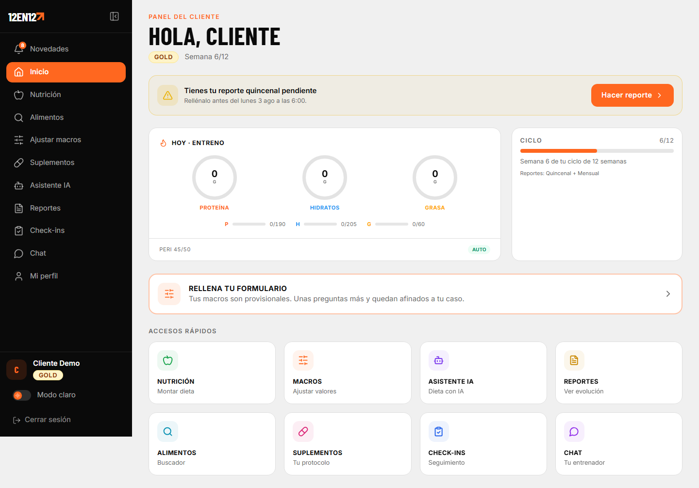

La pantalla de inicio. De arriba abajo:

**Cabecera**: *"Hola, {nombre}"*, con la insignia del plan y *"Semana 6/12"*.

**Aviso de reporte pendiente** (si toca esta semana): amarillo si está en plazo, rojo si se
pasó. Los textos cambian según el momento:
- *"Tienes tu reporte quincenal pendiente · Rellénalo antes del lunes 3 ago a las 6:00"*
- *"Este fin de semana toca tu reporte quincenal · La ventana abre el viernes 1 ago"*
- *"Tu reporte quincenal está fuera de plazo · La ventana de esta semana se cerró"*

**Empieza aquí** (los primeros días): tres pasos con barra de progreso — macros calculados,
preferencias de comida configuradas, primer día de comidas preparado. Se cierra solo cuando
se completan los tres, y se puede ocultar con la X.

**Los macros de hoy**: tres aros de progreso (proteína, hidratos, grasa) con lo consumido
frente al objetivo del día, más las barras horizontales debajo. La cabecera dice
**"Hoy · Entreno"** o **"Hoy · Descanso"** (se detecta solo desde la rutina asignada). Si
se pasa de un macro en más de 4 g, el aro se pone rojo. Al pie, el peri-entreno y una
etiqueta **AUTO** si los macros son automáticos.

Si aún no tiene macros, en su lugar aparece *"Configura tus macros"*.

**Ciclo**: *"Semana 6 de tu ciclo de 12 semanas"* con barra de progreso, y qué reportes
lleva su plan.

**Próxima renovación**: fecha y precio.

**Avisos**, en este orden si aplican varios:
1. *"Rellena tu formulario · Tus macros son provisionales. Unas preguntas más y quedan
   afinados a tu caso."*
2. *"Elige cómo quieres hacerlo · Tres niveles, el mismo método."* (si no tiene plan)
3. *"¿Quieres que un entrenador revise tus macros? · Una revisión suelta, sin cambiar de
   plan. Si luego subes de plan, te lo descontamos."*
4. *"Revisión en marcha · Un entrenador está revisando tus macros."*
5. *"Completa tu perfil para tu coach"*

**Accesos rápidos**: ocho tarjetas — Nutrición, Macros, Asistente IA, Reportes, Alimentos,
Suplementos, Check-ins y Chat. Las que su plan no incluye no aparecen.

### La navegación

**En escritorio**, menú lateral oscuro plegable con: Novedades (campana), Inicio, Nutrición,
Alimentos, Ajustar macros, Suplementos, Asistente IA, Reportes, Check-ins, Chat y Mi
perfil. Abajo, su nombre, el plan, el interruptor de modo oscuro y cerrar sesión.

**En móvil**, barra superior con hamburguesa y barra inferior con cuatro accesos (Inicio,
Nutrición, Macros, Más).

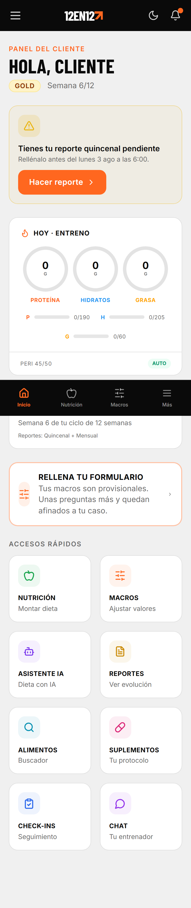

### El gating: qué se ve y qué no

Cada plan trae una matriz de **habilitaciones** que decide qué secciones existen para ese
cliente. Si una sección no le corresponde:

1. **No aparece en el menú** (no hay ni enlace)
2. **La ruta directa redirige al panel**, en silencio, sin pantalla de "acceso denegado"

Mientras el perfil está cargando se muestra todo, para que la interfaz no parpadee. Un
cliente **sin plan o con el pago a medias no ve nada**: solo la pantalla de elegir plan.

## 1.8 Nutrición · `/dashboard/nutrition`

La pantalla más grande de la app (casi 2.000 líneas de código y 27 componentes).

### La primera vez

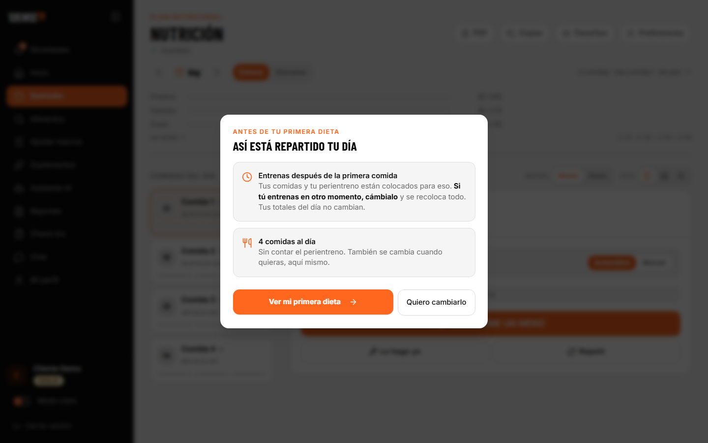

Antes de nada, dos pantallas de bienvenida:

**"Antes de tu primera dieta · Así está repartido tu día"** — le explica dónde entrena
(*"Entrenas después de la primera comida. Tus comidas y tu perientreno están colocados para
eso. Si tú entrenas en otro momento, cámbialo y se recoloca todo. Tus totales del día no
cambian."*) y cuántas comidas hace. Dos botones: "Ver mi primera dieta" o "Quiero
cambiarlo".

Después, un **tutorial de 3 pasos**: elige el día, prepara tus comidas, sigue tus macros.

Y antes de todo eso, la primera vez de todas, la **configuración de preferencias**: 36
categorías de alimentos en dos pestañas, "Me gusta" (mínimo 3, con grasas buenas siempre
obligatoria) y "Evitar" (por categoría o por palabra suelta, para alergias).

### La pantalla

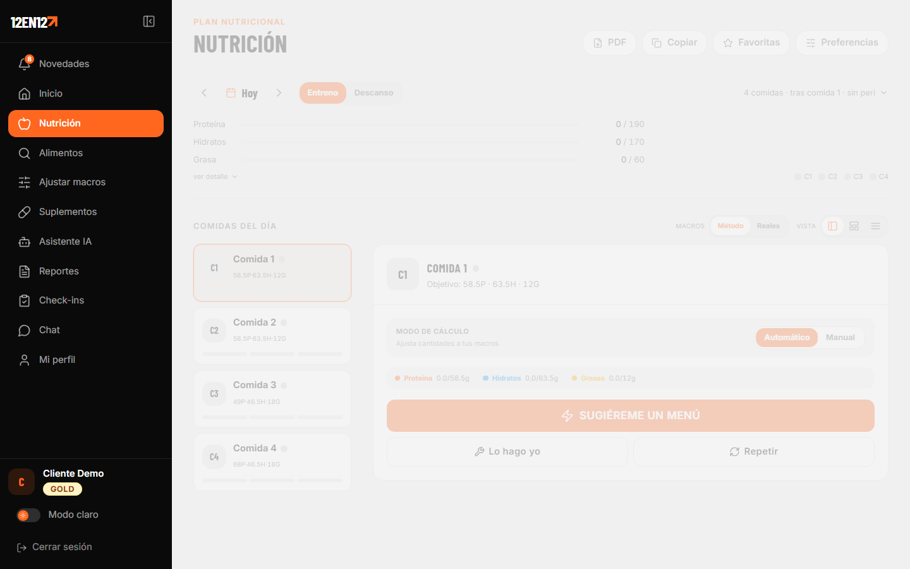

**La cabecera del día**:
- Flechas para moverse de día y un botón de fecha que abre el calendario del mes
- **Entreno / Descanso** (se detecta solo desde la rutina, se puede cambiar)
- Una línea plegada con la configuración: *"4 comidas · tras comida 2 · intra + post"*
- **Tres barras de macros del día** (proteína, hidratos, grasa) con lo servido frente al
  objetivo. Se ponen rojas si se pasa de 4 g
- El peri aparte, y un enlace "ver detalle" que despliega una tabla comida a comida
- **Puntos de estado de cada comida**, siempre visibles

> Estas barras muestran **siempre los macros del método**, pase lo que pase con el
> interruptor de abajo.

**El calendario del mes**:

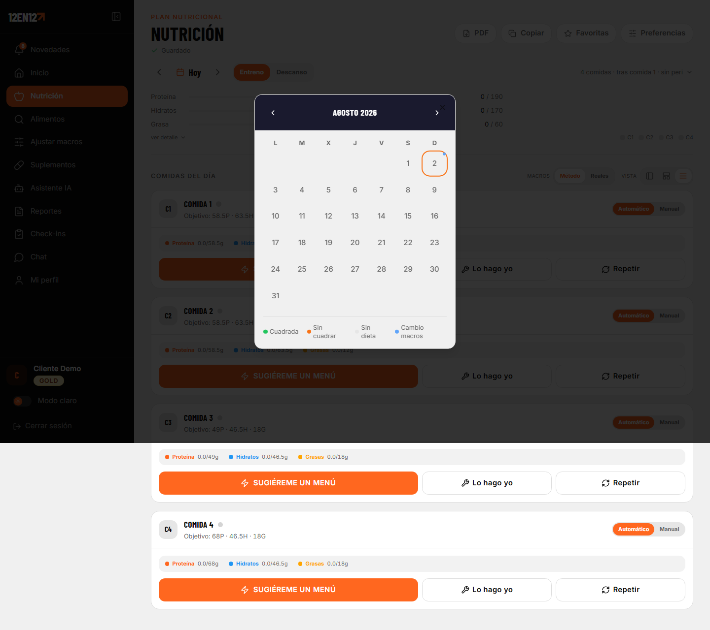

Cada día se colorea: verde si hay dieta y está cuadrada, naranja si hay dieta sin cuadrar,
sin color si no hay nada. Anillo naranja en el día de hoy y azul en los días en que
cambiaron sus macros.

### Las tres vistas

Un selector de tres botones cambia cómo se ven las comidas. La elección se recuerda en ese
navegador.

**1. Lista y detalle** (por defecto): en escritorio, la lista de comidas a la izquierda y
el detalle de la seleccionada a la derecha. En móvil, un acordeón.

**2. Pestañas**: una franja de pestañas arriba y el detalle debajo, a todo el ancho.

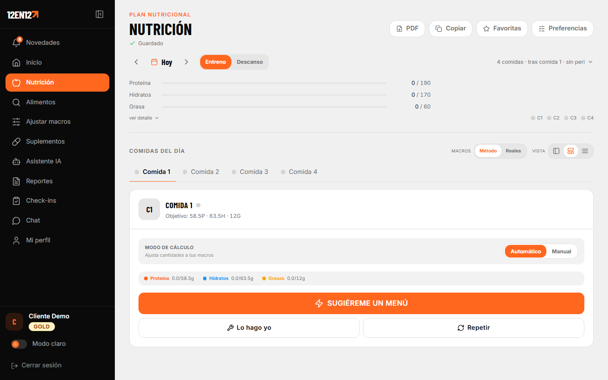

**3. Todo seguido**: el día entero desplegado, todas las comidas una detrás de otra, en
formato compacto. Es la que imita la dieta de Calma.

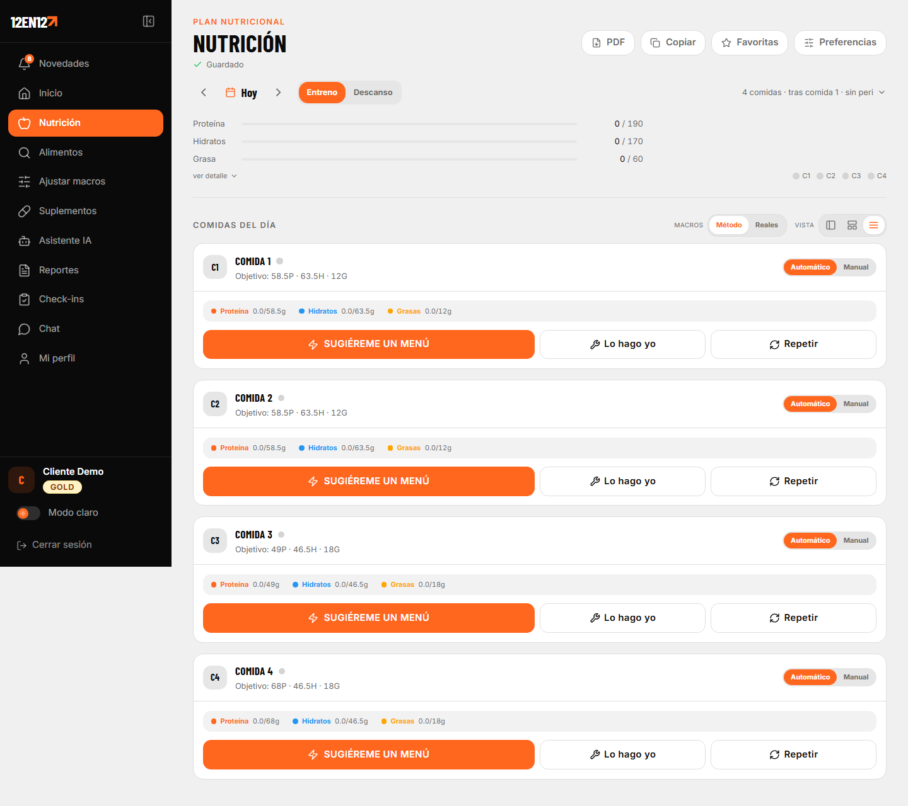

### Cada comida

- **Cabecera**: nombre, punto de estado, objetivo (*"Objetivo: 45P · 60H · 20G"*), y un
  rayo si es Intra o Post
- **Modo de cálculo**: Automático (*"Ajusta cantidades a tus macros"*) o Manual (*"Cantidad
  libre, sin autoajuste"*)
- **Los tres macros** con su estado: **Cuadrado** (verde), **Válido** (ámbar, a menos de
  4 g), **faltan Xg** o **sobran Xg** (rojo)

**Si la comida está vacía**, tres formas de empezar:
- **"Sugiéreme un menú"** — de la biblioteca real (ver abajo)
- **"Lo hago yo"** — abre el constructor paso a paso
- **"Repetir"** — copia una comida de otro día

En Intra y Post solo hay dos: sugerir menú o construir.

**Si tiene alimentos**: la lista, y debajo "Añadir ingrediente", **"Cuadrar"** (ajusta las
cantidades a los macros sin pasarse) y **"Vaciar"** (sin diálogo de confirmación, pero con
8 segundos para deshacer).

### Cada alimento

- **El nombre es un enlace naranja si es un producto de marca** (abre su ficha); si es
  genérico, texto plano
- Los macros: *"47.4g proteína · 26.6g hidratos"* en escritorio, *"47.4P · 26.6H"* en móvil
- Botón de reordenar con su número de prioridad
- **Cantidad**: botones −/+ , o pulsando el número se escribe directamente
- Papelera

El incremento de los −/+ es inteligente: una unidad entera si el alimento va por unidades,
50 g en verduras y bebidas vegetales, 5 g en salsas zero, 1 g en el resto.

**Si la cantidad baja del mínimo, el alimento se elimina** en vez de quedarse en "0 ud".

Los alimentos por unidades se editan en unidades ("2 ud", con medias permitidas) y los de
granel en gramos; por dentro siempre se guardan gramos.

### El interruptor Método / Reales

Cambia lo que se ve **en la línea de macros de cada alimento**, y nada más.

- **Método**: lo que de verdad cuenta
- **Reales**: lo que dice la etiqueta

Existe porque el método no cuenta todo: 100 g de almendras son 21 g de proteína en el
paquete y **0 g** para el método. Quien mira el envase y ve otra cifra se descoloca.

Cuando está en "Reales" aparece un aviso ámbar: *"Cada alimento muestra lo que dice su
etiqueta. Los totales, los objetivos y el estado de cada comida siguen siendo los del
método."*

**No cambia nada más**: ni cantidades, ni objetivos, ni si una comida está cuadrada, ni lo
que se guarda.

### El constructor de comida

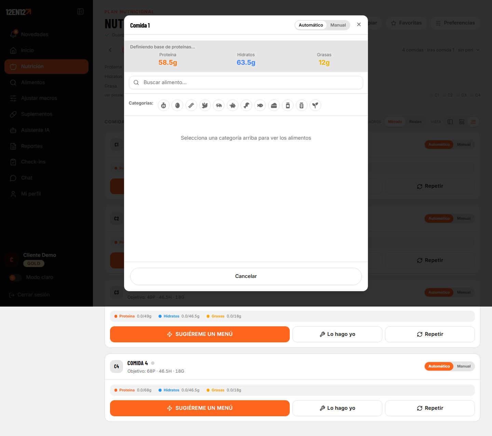

Guía por fases que se recalculan solas:

1. **Proteínas** — 11 categorías
2. **Acompañamiento** — 20 categorías (arroces, panes, cereales, pasta, tubérculos, fruta,
   verduras, legumbres...)
3. **Últimos toques** — solo sus categorías preferidas, más las grasas buenas

Se pasa de fase cuando la proteína (o proteína e hidratos) supera el **80 %** del objetivo,
con un aviso: *"✅ Proteínas cubiertas. Elige el acompañamiento."* **Y retrocede** si se
quita lo que había cubierto: es reactivo, no un avance de una sola dirección.

En **modo manual** desaparecen las fases: se ven las 36 categorías de golpe y la cantidad
es libre.

En modo automático, si un alimento haría que la comida se pasara del objetivo más 4 g de
margen, **se bloquea** con un aviso de qué macro se pasaría.

El botón de guardar cambia a verde cuando la comida queda cuadrada: *"🎉 GUARDAR COMIDA
CUADRADA"*.

### "Sugiéreme un menú": la biblioteca real y el recetario

El botón abre un modal con **dos pestañas**.

**Biblioteca.** Los menús salen de **266.000 comidas reales de clientes**, ya cuadradas,
minadas del histórico. No son inventadas.

Controles: **margen** (2-10 g), **orden** (más cuadrado / más usado), **vista** (método o
reales) y un filtro por alimento.

Cada menú se ajusta con lo que en el código se llaman **palancas**: se toca solo el
alimento que domina cada macro, en orden proteína → hidratos → grasa, y solo dentro de unos
límites (±20 g de proteína, ±30 g de hidratos, ±8 g de grasa). Nunca se parten unidades.

Un menú se marca **"Clavado"** si el error total es menor de medio gramo, **"Cuadrado"** si
los tres macros quedan a menos de 4 g, y **se descarta** si aun ajustando queda a más de
12 g.

**Recetario.** Las **99 recetas** de la membresía ELM, con chips por momento del día
(desayunos, comidas, meriendas, cenas) y buscador por nombre o por ingrediente. Aquí no hay
cantidades cerradas: al elegir una receta, el motor la **cuadra a tus macros**. Los platos
principales están guardados dos veces, en comida y en cena, y en la lista salen una sola vez
con las dos etiquetas.

La diferencia entre las dos pestañas, en una frase: la biblioteca te da **un menú que ya le
cuadró a alguien** y lo acerca a ti; el recetario te da **una receta** y le pone tus
cantidades.

### Otras acciones

- **Copiar el día** a otra fecha (no deja copiar al pasado)
- **Repetir una comida** de otro día: se listan los últimos 14 días con dieta, y al elegir
  una comida **se reescala por proteína** al objetivo de la comida destino, recalculando
  cada macro de verdad
- **Dietas favoritas**: guardar el día como plantilla con nombre. Al aplicar una de un tipo
  de día distinto, pregunta: *"Adaptar a mi día de hoy"* (recalcula cantidades) o *"Aplicar
  como se guardó"* (cambia el tipo de día)
- **Sugerir un alimento** que falte en el catálogo (ver [1.10](#110-alimentos--dashboardfoods))
- **PDF** del día (ver [4.5](#45-el-pdf))

### El volcado de macros

Cuando solo queda **una** comida sin cuadrar, aparece *"Volcar macros aquí"*. Esa comida
absorbe todo lo que queda del día y **las demás quedan bloqueadas**, con un aviso:
*"Bloqueada - los macros del día están volcados en otra comida."*

### Guardado

Se guarda solo, 1,5 segundos después de cada cambio. Además:
- Copia local en el navegador antes de cada intento, por si falla la red
- **Guardado de emergencia** al cerrar la pestaña o cambiar de app en el móvil
- Reintentos automáticos al cargar (2 veces) antes de avisar de que no hay conexión

## 1.9 El asistente de IA · `/dashboard/chatbot`

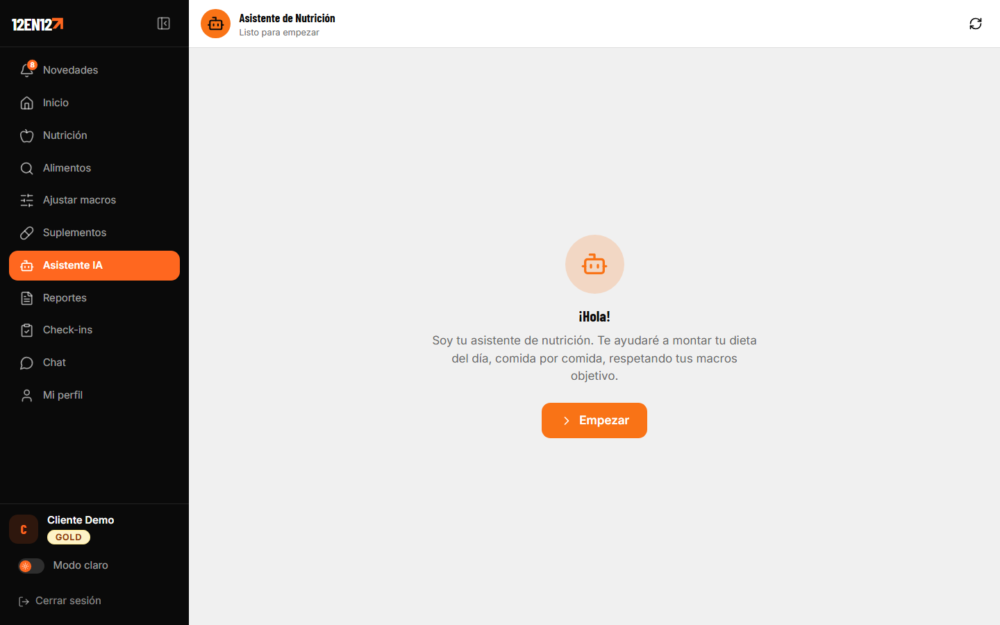

Monta la dieta hablando. Empieza con *"¡Hola! Soy tu asistente de nutrición. Te ayudaré a
montar tu dieta del día, comida por comida, respetando tus macros objetivo."*

**La configuración, en cinco preguntas con botones**:
1. ¿Para qué día quieres montar la dieta? — Hoy / otra fecha
2. ¿Es día de entrenamiento o de descanso?
3. ¿Cuántas comidas vas a hacer, 3 o 4?
4. ¿Cómo gestionas el peri-entreno? — Intra + Post / Solo Post / Solo Intra / Sin peri
5. ¿Cuándo entrenas? — en ayunas o después de la comida 1, 2 o 3

En descanso se salta la 4 y la 5.

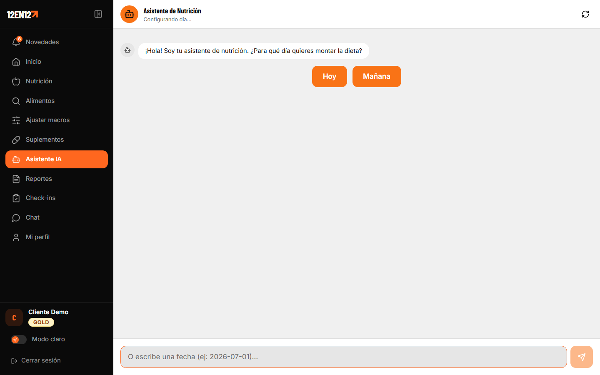

Luego va comida por comida: *"Vamos con Comida 1. Tu objetivo es: Proteína 50 g · Hidratos
30 g · Grasa 10 g. ¿Qué quieres tomar?"*

### Qué entiende

**Doce intenciones**: añadir, sugerir, completar la comida, quitar, vaciar, estado,
resumen, recuadrar, ir a otra comida, listar, preguntar y "ninguna".

Con las cantidades entiende: *"150 g de pavo"*, *"2 huevos"*, *"ponme más arroz"*, *"la
mitad de zumo"*, *"quita 100 gramos de arroz"*, *"baja las almendras a 26 g"*, *"deja los
huevos en 2"*.

### Lo que hace que no se atasque

**Interpreta al vocabulario del catálogo.** La gente no habla como está escrito el
catálogo: pide "tostadas" y ahí pone "Pan tostado", pide "chuches" y pone "Gominolas". El
router traduce en la misma llamada que ya hace para clasificar la intención, así que no
cuesta latencia. Dos frenos:
- **Lo que escribe el usuario manda**: la traducción solo entra si la búsqueda directa no
  encuentra nada
- **No se traducen los términos ambiguos a propósito** (pavo, lomo, filete, queso, yogur):
  esos se preguntan

Y cuando entra por interpretación, **se dice**: *"tostadas lo tengo como Pan tostado"*.

**Busca por raíz.** "tostadas", "tostada", "tostado" y "tostados" caen todos en `tostad`.
La raíz nunca baja de cuatro letras, porque `pavo` → `pav` emparejaría media base.

**Tolera cómo se escribe de verdad.** Media España sesea y en el móvil se escribe rápido:
"sumo" por "zumo", "cosido" por "cocido", "berengena" por "berenjena".

**Pregunta cuando hay varias opciones** en vez de adivinar. El orden de esas opciones es:
primero lo que de verdad **es** lo pedido, luego el **genérico** antes que la marca, y
dentro de eso, lo que mejor cuadra con lo que falta.

**Pide más de lo mismo.** *"¿Hay otras opciones de tostadas?"* devuelve más tostadas, sin
repetir las ya vistas. Cuando de verdad se acaban, lo dice y pregunta: *"¿Quieres que te
sugiera otra cosa parecida, o prefieres decirme tú qué te apetece?"*

**Cuando no encuentra algo, pregunta** en vez de dejar un callejón: *"No lo tengo con ese
nombre. ¿Cómo lo llamas normalmente, o quieres que te sugiera algo parecido?"*

### En móvil

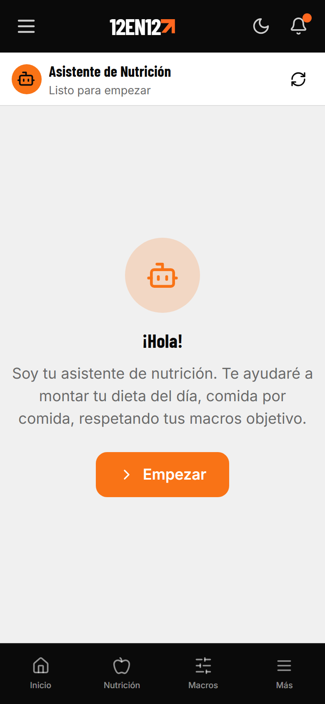

Cabecera compacta, botones en rejilla de tres y campo de texto de 16 px (por debajo de eso,
iOS hace zoom solo al escribir).

### Por debajo

Usa **gpt-4.1-mini**. La sesión se guarda en base de datos (no en memoria) con caducidad de
7 días, para que sobreviva a reinicios y funcione con varios procesos a la vez. Al cerrar
sesión se borra.

## 1.10 Alimentos · `/dashboard/foods`

El buscador global del catálogo (unos 3.200 alimentos). A diferencia del buscador de dentro
de una comida, **este no depende del servidor para filtrar**: carga el catálogo entero una
vez y busca en local, replicando el algoritmo de relevancia de Calma.

Cada alimento muestra: nombre (enlazado si es de marca), sus macros, si va **por 100 g o
por unidad**, sus categorías, la cantidad mínima para que el sistema lo sugiera y una línea
del tipo *"Necesita 5 g de proteínas para ser sugerido"* o *"Siempre puede ser sugerido"*.

Filtros: por categoría en cascada (cada una es un Y), "Mostrar solo genéricos" y "No
aportan macros".

**Sugerir un alimento**: si falta algo, el cliente lo propone con nombre, si va por unidad
o por 100 g, si el peso es neto o escurrido, sus macros, el enlace de la fuente y **dos
fotos** (el frente y la tabla nutricional). Máximo **2 sugerencias por semana** y 6 MB por
foto. El admin lo revisa y, si lo aprueba, entra al catálogo y **se avisa al cliente**.

## 1.11 Ajustar macros · `/dashboard/macro-calculator`

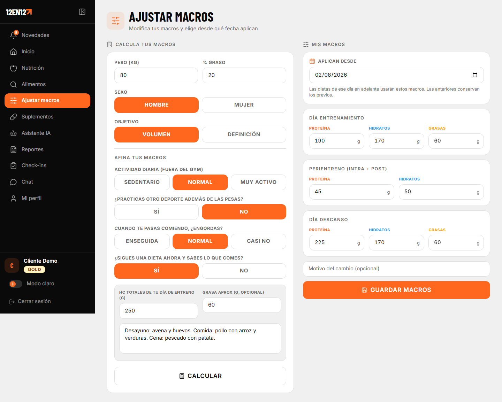

Dos zonas: un **simulador** ("si tuviera este peso y este % de grasa, mis macros serían
estos") y el **editor de sus macros reales**.

El cliente introduce peso, sexo, % de grasa y objetivo, pulsa calcular, y si le convence,
"Usar estos valores" los copia al editor. Al guardar puede poner una **fecha de vigencia**:
las dietas anteriores a esa fecha conservan los macros de antes.

Ese guardado **queda versionado** en su historial, con quién lo hizo y por qué.

Si al guardar la dieta que declara no cuadra con lo esperado para su % de grasa, se crea
una **revisión pendiente** y se avisa al entrenador.

## 1.12 Suplementos · `/dashboard/supplements`

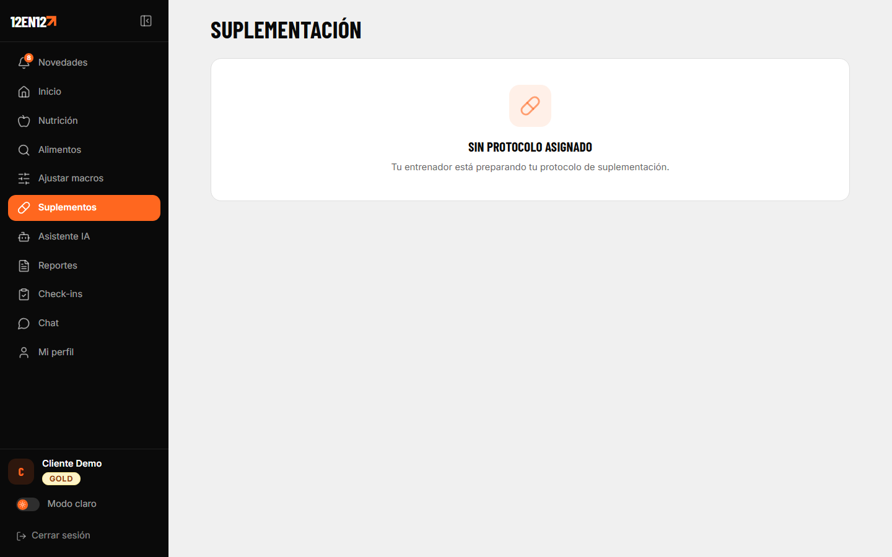

Solo para planes que lo incluyen. Texto introductorio fijo aclarando que es **orientativo**.

Dos bloques: **suplementación actual** y **siguiente** (con la fecha a partir de la cual
entra), más una **nota personal** del coach.

Cada suplemento muestra su imagen, **¿cuándo?** (el timing), **¿cuánto?** (la dosis),
observaciones y enlaces de compra.

No hay nada que marcar: es informativo.

## 1.13 Check-ins · `/dashboard/checkins`

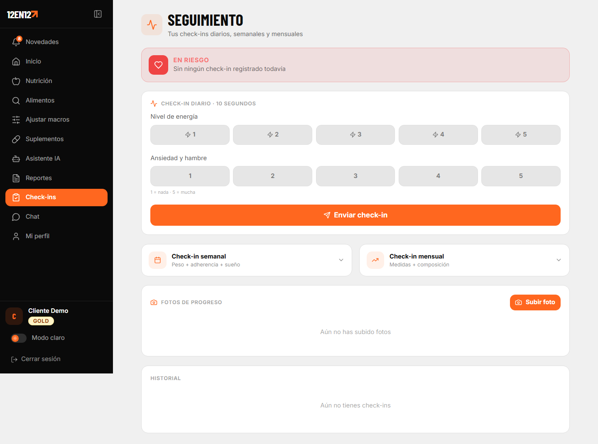

Tres niveles.

### El diario · dos campos

**Solo dos**: **nivel de energía** (1-5) y **ansiedad y hambre** (1-5, con la ayuda *"1 =
nada · 5 = mucha"*).

Antes tenía cinco: ánimo, energía, ¿entrenaste hoy?, ¿seguiste tu plan? y notas. Se
recortó porque **preguntar por algo que el sistema ya sabe es hacerle trabajar para nada, y
encima su respuesta puede contradecir al registro**. Energía y hambre son lo único que no
consta en ningún otro sitio.

**La dieta se rellena sola**: si ese día registró alimentos, se marca como cumplida.

> **El entrenamiento no.** Ver [5.2](#52-huecos-reales).

### El semanal

Peso (obligatorio), adherencia de entreno y de nutrición (%), sueño (1-10), estrés (1-10) y
notas.

### El mensual

Peso, % de grasa, medidas (pecho, cintura, cadera, brazo, muslo), progreso hacia los
objetivos, dificultades y notas.

### El semáforo

Un indicador verde / amarillo / rojo calculado así:

- **Rojo**: baja automática por impagos, o nunca ha hecho un check-in, o lleva 14+ días sin
  hacerlo, o su adherencia media está por debajo del 50 %
- **Amarillo**: 7-14 días sin check-in, o adherencia entre 50 y 75 %, o pago atrasado, o
  algún cobro fallido
- **Verde**: el resto

Solo empeora: un factor leve nunca rebaja uno grave.

### Fotos de progreso

Se suben desde aquí (máximo 4 MB, JPEG/PNG/WebP/HEIC). El cliente ve las suyas en una
rejilla y puede borrarlas. El coach las ve desde la ficha, en solo lectura.

## 1.14 Reportes y el informe mensual · `/dashboard/reports`

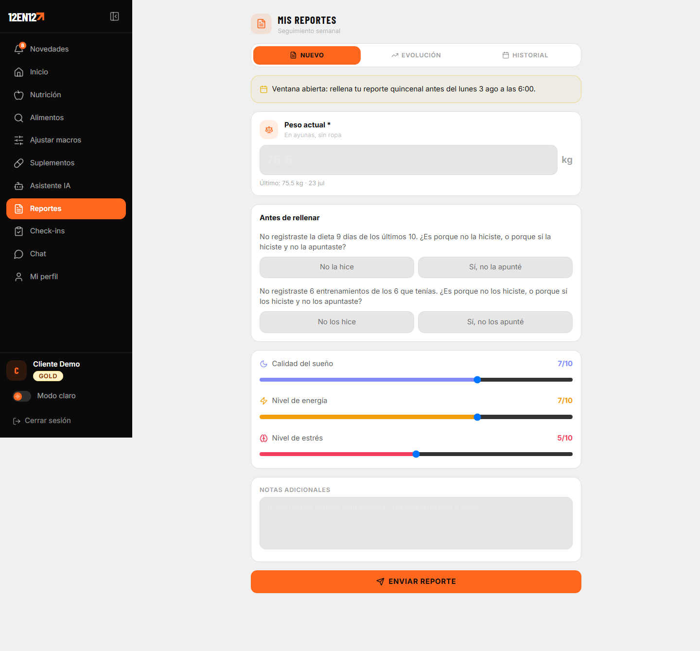

### Cuándo toca

| Reporte | En qué semanas del ciclo | Qué planes |
|---|---|---|
| Quincenal | Las pares (2, 4, 6, 8, 10) | Nivel 2 y 3 |
| Mensual | Semanas 3, 7 y 11 | Los tres niveles |
| Semanal | Todas | Solo planes especiales |

**La ventana de envío es la misma para todos: del viernes a las 00:00 al lunes a las 6:00.**
Fuera de ella, el formulario está deshabilitado y el mensaje lo explica.

### El formulario

**1. Peso actual** (obligatorio) — *"En ayunas, sin ropa"*, con el último peso como
referencia.

**2. Medidas — solo en el mensual.** En el quincenal no se piden: ese reporte son "dos
minutos" y sacar la cinta métrica cada dos semanas para un dato que apenas se mueve no
compensa. En el mensual, **la cintura es obligatoria** y el resto va plegado tras un enlace.

**3. La confirmación de huecos.** Esto sustituyó a los deslizadores de cumplimiento. En vez
de pedirle que se puntúe, se le enseña lo que no registró:

> *"No registraste la dieta 4 días de los últimos 14. ¿Es porque no la hiciste, o porque sí
> la hiciste y no la apuntaste?"*

Dos botones: **"No la hice"** / **"Sí, no la apunté"**.

**De ahí sale el cumplimiento.** Un deslizador mide lo que el cliente *cree* que ha
cumplido, que es una opinión; los días sin registrar son un hecho, y lo único que no
sabemos de ellos es si no lo hizo o si lo hizo y no lo apuntó. Un hueco sin contestar
cuenta como no hecho: no se le regala cumplimiento por callar.

Del entrenamiento **solo se pregunta si se sabe cuántos entrenos tocaban**. Contar los días
de descanso como entrenos fallados sería acusarle de algo que no ha pasado.

**4. Tres deslizadores**, los únicos que quedan: calidad del sueño, nivel de energía y
nivel de estrés. Son lo que no se puede deducir de ningún registro.

**5. Notas** (libre).

### El informe que recibe

**Ocho apartados**:

1. **Dónde estás** — *"Semana 6 de 12"*
2. **Tu peso** — el cambio **en porcentaje**, no en kilos, con el ritmo semanal y el
   veredicto: *"Al ritmo que te toca"* (verde), *"Más lento de lo que te tocaría"* (ámbar)
   o *"Más rápido de lo que conviene"* (rojo). Y la explicación: *"Vas a -0,6 % por semana.
   A ti te toca entre -0,5 % y -1 %, por tu objetivo y tu punto de partida"*
3. **Porcentaje de grasa** — el actual y de dónde venía
4. **Fotos** — hasta 6: tres de hoy y tres del **primer** reporte con fotos (no del mes
   pasado; la comparación que enseña el cambio es contra el día uno)
5. **Lo que has cumplido** — dos barras (dieta y entrenos) en verde (≥80 %), ámbar (≥50 %)
   o rojo
6. **Lo que te tocaba y lo que comiste** — macro a macro, con el desvío en porcentaje
7. **Tus macros de este mes** — los nuevos, con la explicación
8. **Cómo vas respecto a gente como tú** — el percentil frente a personas de su mismo sexo,
   objetivo y tramo de grasa

**Dos condiciones que no se saltan**:

- **Sin fotos no se genera el informe.** *"Sin fotos no podemos comparar. Te lleva un minuto
  y es lo que de verdad enseña lo que ha cambiado."* No se genera uno a medias
- **El objetivo de ritmo sale de su perfil**: no se puede felicitar igual a quien viene del
  35 % de grasa que a quien está al 12 %

### Quién escribe la explicación

**En los Niveles 2 y 3, una persona.** Si el coach aún no la ha escrito, el cliente ve:
*"Tu entrenador está revisando tu mes. En cuanto lo tenga, te lo contamos aquí."* Nunca se
inventa un texto en su lugar.

**En el Nivel 1, el sistema**, con textos escritos desde el alivio y no desde la exigencia:

- Si registró pocos días: *"Este mes no te tocamos los macros. La dieta se ha registrado
  pocos días y, sin saber qué has comido de verdad, cambiar los números no arregla nada:
  solo tapa el problema."*
- Si va al ritmo: *"Vas al ritmo que te toca, así que no hay motivo para tocar nada."*
- Si va lento: *"Hemos ajustado los macros para desatascarlo; no hace falta que aprietes por
  tu cuenta."*
- Si va rápido: *"Bajar así se lleva por delante músculo, que es justo lo que no queremos."*

### La evolución de referencia

El octavo apartado compara su ritmo con el de gente de su perfil y devuelve un percentil.

**Por debajo de 8 personas no se enseña nada.** Con tres o cuatro detrás, decirle a alguien
que va "mejor que la media" es ruido disfrazado de dato, y encima permitiría deducir el
progreso de un cliente concreto.

Solo salen agregados: percentil, tamaño de la cohorte y media. Nunca el dato de nadie. Y
siempre con la nota: *"Tu objetivo sigue siendo el tuyo; esto es solo para situarte."*

En mantenimiento no se compara: ahí "ir mejor" no significa nada.

## 1.15 Chat · `/dashboard/messages`

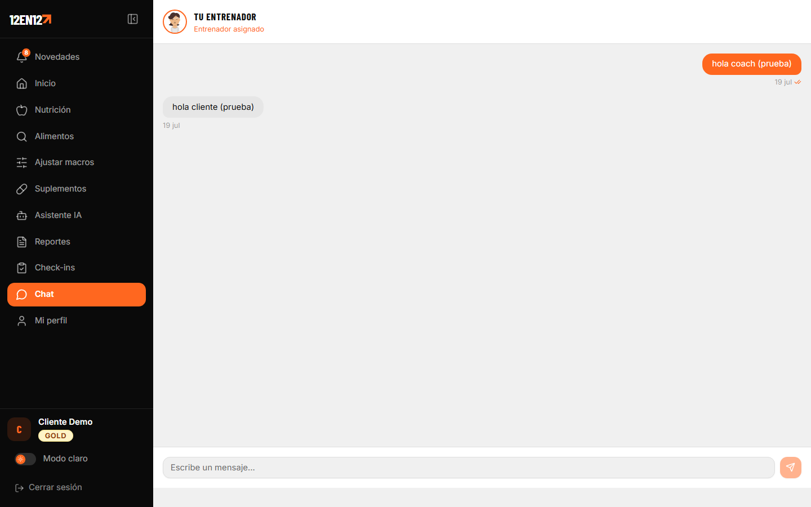

Chat directo con su entrenador. Si no tiene coach asignado, va a soporte. Burbujas con
tictacs tipo WhatsApp (gris = enviado, naranja = leído) y refresco cada 5 segundos.

## 1.16 Mi perfil · `/dashboard/profile`

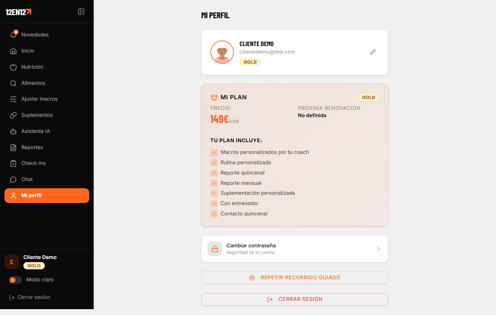

Avatar, nombre, correo y plan. Se puede editar **nombre y teléfono** (el correo no).

**Mi Plan**: precio, próxima renovación y la lista de lo que incluye, generada desde sus
habilitaciones reales.

**Ajustes**: cambiar contraseña (pide la actual, la nueva de 8+ caracteres y repetirla).

**Repetir recorrido guiado** y **cerrar sesión**.

> No hay ningún botón para darse de baja ni gestionar la suscripción. Ver
> [5.2](#52-huecos-reales).

## 1.17 La renovación de la semana 12 · `/renovacion`

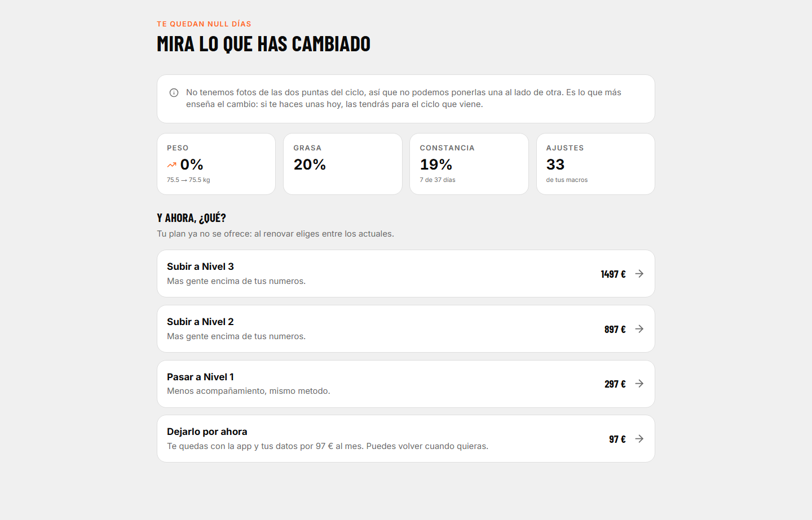

Aparece dos semanas antes de que acabe el ciclo.

**El orden importa y es deliberado: primero lo que ha conseguido, después lo que puede
hacer.** Al revés sería un cobro con fotos de adorno; así es un balance del que sale una
decisión.

1. **"Tú, el primer día y hoy"** — las fotos comparadas. Si falta alguna de las dos puntas,
   **no se enseña una comparación a medias**: se dice que falta y se le anima a hacérselas
   hoy para el ciclo siguiente
2. **Cuatro métricas**: peso (% y kg), grasa, constancia (días con dieta registrada) y
   número de ajustes de macros
3. **Y ahora, ¿qué?** — *"Si no haces nada, tu plan se renueva solo y sigues sin
   interrupciones."*

**Tres salidas**, en este orden:
1. **Seguir igual** — con badge "Tu precio de siempre" si lo tiene congelado. No abre
   ningún pago: *"Perfecto, seguimos. No tienes que hacer nada más."*
2. **Cambiar de nivel** — los otros, de más caro a más barato. Subir se prioriza, pero bajar
   no se esconde
3. **Dejarlo por ahora** — la membresía de 97 €/mes

Si su plan es legacy: *"Tu plan ya no se ofrece: al renovar eliges entre los actuales."*

## 1.18 Rutina (hoy oculta)

La sección de rutina **está apagada para todos los clientes** desde el 19-07-2026, sea cual
sea su plan. No aparece en el menú, no hay tarjeta en el panel, y entrar por URL directa
redirige al inicio (esa captura es la prueba: se pidió `/dashboard/routine` y salió el
panel).

El backend la sigue sirviendo y **el coach la sigue generando y guardando con normalidad**
desde el panel. Solo la vista del cliente está oculta, a la espera de completar la
funcionalidad. Se reactiva cambiando una línea.

Cuando esté visible, el cliente verá los 7 días con sus ejercicios (series, repeticiones,
descanso, notas y vídeo), el cardio del día y las notas del entrenador. **No hay forma de
marcar un entreno como hecho.**

---

# Parte 2 · El recorrido del equipo

## 2.1 El panel de control · `/admin`

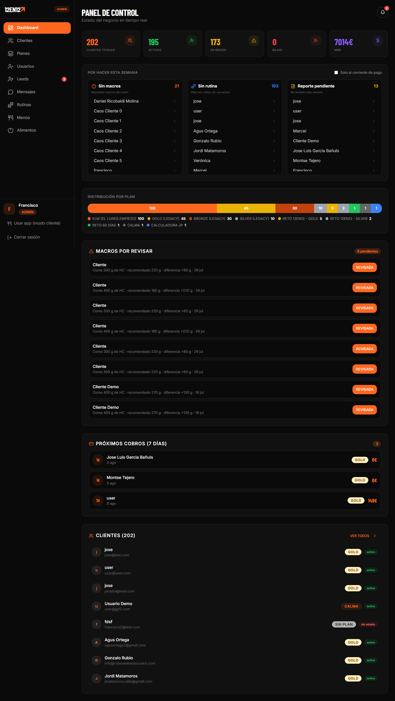

### Lo primero de todo: quién espera una llamada

Si alguien eligió el Nivel 3 en el test, aparece **por encima de los KPIs** una alerta
naranja: **"Piden que les llamemos"**, con su nombre, correo, el **teléfono pulsable** y
cuántos días lleva esperando (en rojo a partir de dos). Un botón *"Ya le he llamado"* lo
saca del aviso y lo deja como contactado en el CRM.

**Solo aparece cuando hay alguien esperando.** Un aviso que está siempre deja de ser un
aviso.

### Los cinco números

Clientes totales, activos, en riesgo, bajas y MRR.

"En riesgo" son los activos que llevan 3+ semanas y no mandan reporte desde hace 14 días.

### Por hacer esta semana

Tres columnas accionables, con un filtro de "solo al corriente de pago":

- **Sin macros** — su plan espera macros del coach y no los tiene
- **Sin rutina** — su plan incluye rutina y no tiene ninguna activa
- **Reporte pendiente** — no lo ha enviado esta semana (con etiqueta "tarde" si se pasó)

Cada nombre lleva a su ficha. Un punto rojo marca a los que no están al corriente de pago.

### Lo demás

- **Distribución por plan**: barra apilada con leyenda
- **Macros por revisar**: dietas reportadas que no cuadran con lo recomendado, con
  *"Come 250 g de HC · recomendado 190 g · diferencia +60 g"* y un botón "Revisada"
- **Próximos cobros (7 días)**: días restantes, cliente, plan e importe
- **Clientes**: los 8 primeros, con acceso al listado completo
- **Campana de novedades**: leads nuevos sin gestionar y mensajes sin leer

## 2.2 La ficha de un cliente · `/admin/clients/{id}`

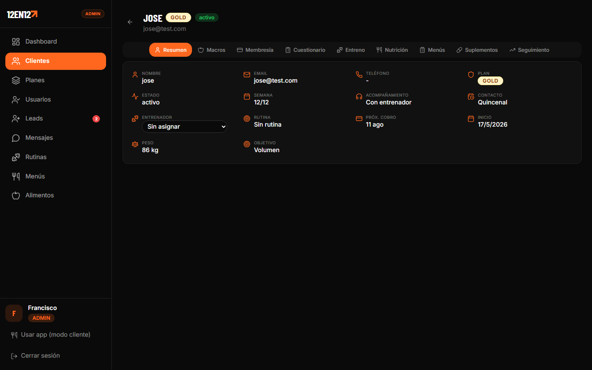

Nueve pestañas. Es la pantalla donde el coach hace su trabajo.

### Resumen

Nombre, correo, teléfono, plan, estado, semana del ciclo, **acompañamiento** y **frecuencia
de contacto** (que salen del catálogo del plan, no del cliente), entrenador, rutina, próximo
cobro, alta, peso y objetivo.

**El selector de entrenador** aplica las reglas de permisos: un admin asigna a quien quiera;
un trainer solo puede **asignarse a sí mismo** clientes sin coach, y solo puede cambiar el
coach si es él el actual.

### Macros — la más importante

**Editor siempre visible** con tres bloques (entrenamiento, perientreno, descanso). Los
campos que difieren de lo guardado se resaltan y muestran *"ahora 190 g"* debajo, con un
badge **"sin guardar"**.

Debajo:
- **Vigente desde**: si se pone una fecha futura o pasada, un aviso explica el efecto
- **% graso** del momento del ajuste
- **Criterio del ajuste (interno)** — *no lo ve el cliente*, es lo que aprende el modelo
- **Feedback para el cliente (obligatorio)** — le llega como novedad al guardar

**Sugerir ajuste (IA)**: un agente propone el ajuste mensual. Muestra su confianza, el
perfil del cliente (motor × respondedor, techo y suelo de hidratos, umbrales), el contexto
de decisión (último peso, deltas, cumplimiento), la propuesta en los tres bloques, los
cambios en texto, el razonamiento en prosa, los avisos y el **guardarraíl**.

Botones "Usar esta propuesta" (la vuelca en el editor) y "Descartar". **Nada se guarda
hasta pulsar "Guardar macros"**, y si el coach corrige la propuesta, esa corrección queda
registrada: es la señal de aprendizaje.

**Historial de macros**: tabla filtrable por fechas con vigencia, peso y % graso, los tres
bloques, el criterio interno, el feedback y **"cómo salió"**. Se puede repetir, editar o
eliminar cada entrada.

**Evaluar cómo salió la fase**: a toro pasado, el coach marca "Buena" o "Mala"; si fue mala,
de quién fue — *"Del ajuste"*, *"No cumplió"* u *"Otro"*. Este dato es el más valioso del
sistema: es lo que alimenta los casos parecidos del agente.

### Membresía

Rol, plan, plan de cortesía (sin pago), dar de baja o reactivar. Historial de pagos e
historial de membresías importadas de Calma.

### Cuestionario

Los datos propios de la app, o los del **cuestionario de Calma** si es un cliente migrado
(con badge amarillo "Importado de Calma"): desde cómo conoció la marca hasta las medidas,
la medicación y la dieta de ejemplo.

### Entreno

Equipamiento, lesiones y la rutina actual. **Generar rutina con IA**: se escriben
instrucciones libres, se previsualiza día a día y se guarda o se descarta. No hay editor
manual campo a campo.

### Nutrición

Top 5 de alimentos más repetidos y un visor de todas sus dietas: fechas a la izquierda,
detalle de la dieta a la derecha, comida por comida.

### Menús

Buscador de menús para el coach: introduce macros objetivo, momento y fuente (recetario o
biblioteca real), y obtiene opciones con sus alimentos y totales. Dos acciones: **copiar** o
**enviar por chat** al cliente.

### Suplementos

Los dos bloques (actual y siguiente) con selector del catálogo, fecha de entrada y nota
personal. Botón de **auto-sugerir** (heurística por sexo y objetivo, sin IA).

> Lo que se asigna es una **copia congelada** del catálogo: si luego se edita el catálogo,
> los protocolos ya asignados no cambian.

### Seguimiento

- Gráfico de evolución del peso
- **Comparador de fotos** antes/después por pose, uniendo las de Calma y las de la app, con
  el peso más cercano anotado
- Línea de tiempo mensual
- Los check-ins (semanales y mensuales en detalle con semáforo por campo, diarios en lista
  compacta), donde el coach escribe su feedback
- La lista de reportes, con etiqueta "con feedback" / "sin feedback" y el cuadro para
  escribirlo

## 2.3 Clientes, usuarios y permisos

El listado de clientes admite filtros por plan, estado y entrenador. Un admin puede además
ver los **registros incompletos** (gente que se registró pero nunca completó el alta).

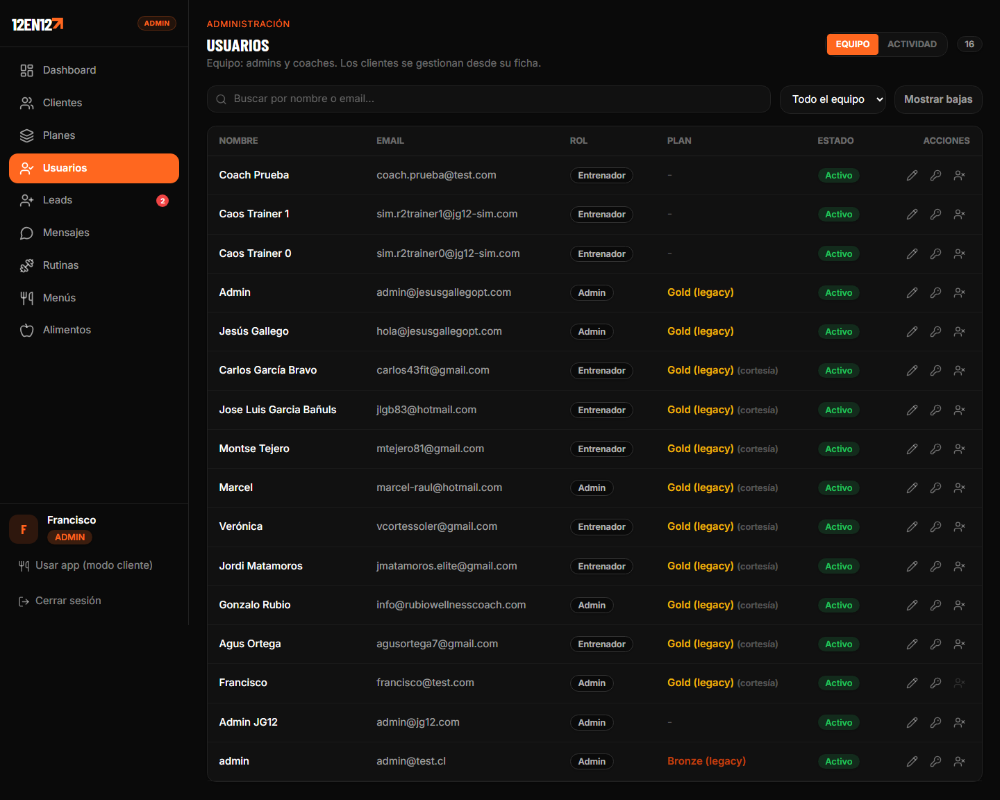

**Usuarios** (solo admin) tiene dos pestañas:

**Equipo** — solo admins y coaches, nunca clientes: *"Los clientes se gestionan desde su
ficha."* Se puede editar, **restablecer la contraseña** (se muestra una sola vez, con el
aviso *"cópiala y pásasela por WhatsApp"*), dar de baja o reactivar.

**Actividad** — el registro de auditoría: quién cambió macros, coaches, roles, contraseñas y
leads, con fecha y actor.

### Resumen de permisos

| | Admin | Trainer |
|---|---|---|
| Ver y editar cualquier ficha | Sí | Sí |
| Cambiar macros, rutinas, suplementos | Sí | Sí |
| Catálogo de planes | Sí | Sí |
| **Pestaña Usuarios** | Sí | **No** |
| Asignar coach | A cualquiera | Solo a sí mismo, y solo si el cliente no tiene coach |
| Ver registros incompletos | Sí | No |

## 2.4 Leads (CRM) · `/admin/leads`

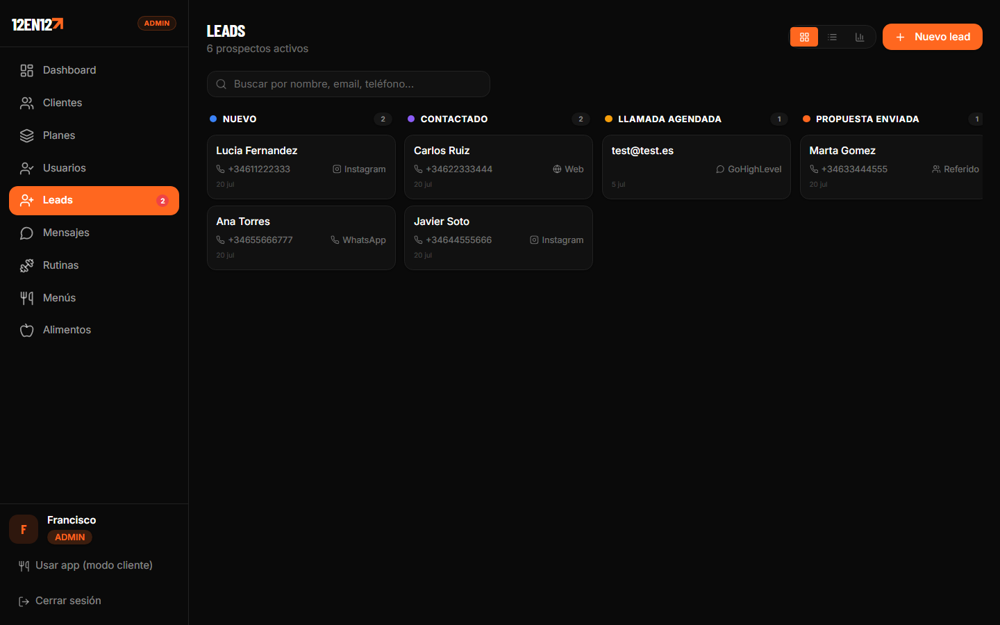

Tres vistas: **kanban** (arrastrable), **tabla** y **métricas**.

**Seis estados**: nuevo, contactado, llamada agendada, propuesta enviada, convertido y
descartado.

**Fuentes**: instagram, web, referido, ghl, whatsapp, otro.

Al mover un lead a **descartado** se pide el motivo: precio, no responde, no interesado, se
fue con otro, no encaja u otro. Si más tarde vuelve a otro estado, el motivo se limpia solo.

**Historial**: notas escritas a mano y eventos automáticos (*"Estado cambiado a
contactado"*, *"Asignado a X"*, *"Próximo contacto: fecha"*).

**Seguimientos vencidos**: un lead con fecha de próximo contacto pasada se marca en rojo y
cuenta en el contador de arriba.

**Convertir a cliente**: crea el usuario y su ficha, genera una contraseña temporal y ofrece
un **mensaje de bienvenida listo para WhatsApp**. Ojo: esta conversión **no pasa por
Stripe**, es un alta manual sin cobro.

**Métricas**: embudo por estado, tasa de conversión, días medios hasta convertir, conversión
por origen, motivos de descarte y leads nuevos por semana.

### El webhook de GoHighLevel

Los leads de fuera entran solos por un webhook. Está protegido con un secreto compartido
(en la URL o en una cabecera).

Reglas de entrada:
- Si el correo **ya es cliente**, no se crea nada
- Si el lead **ya existe**, se completa sin pisar lo que ya había, y **si estaba descartado
  se reabre**: un descartado que vuelve a entrar es interés nuevo
- Si dos webhooks llegan a la vez, el segundo se trata como reentrada

Cada entrada se sincroniza además a **Notion** (base "Leads GHL"). Si Notion falla, se
registra el aviso y el webhook sigue: la app no se cae por eso.

## 2.5 Mensajes · `/admin/messages`

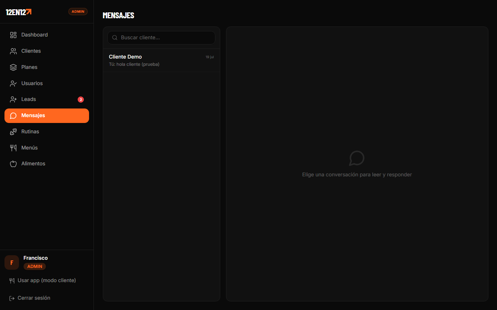

Bandeja de conversaciones con buscador, último mensaje y contador de no leídos. Cada coach
ve **las conversaciones en las que él participa**, no las de otros.

## 2.6 Planes · `/admin/planes`

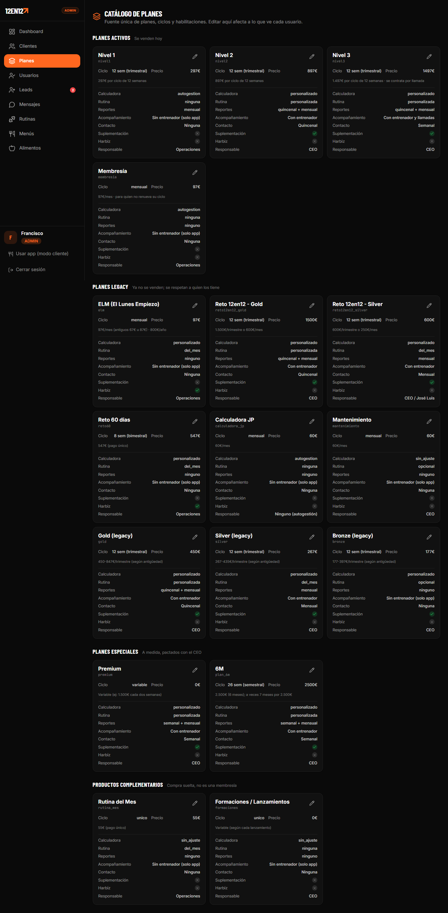

Los planes agrupados en cuatro secciones: **activos** ("se venden hoy"), **legacy** ("ya no
se venden; se respetan a quien los tiene"), **especiales** ("a medida, pactados con el CEO")
y **complementarios** ("compra suelta, no es una membresía").

De cada plan se puede editar: nombre, estado, ciclo, precio, nota de precio, responsable y
todas las **habilitaciones** (calculadora, rutina, acompañamiento, frecuencia de contacto,
reportes, suplementación, Harbiz). Hay una **vista previa en vivo** de lo que verá el
cliente en "tu plan incluye".

Los cambios se guardan como **overrides** sobre el código, con un badge "editado" y un botón
para **restaurar el valor por defecto**. Se propagan solos al test de nivel, a la pantalla
de planes y a la de renovación.

## 2.7 Menús, alimentos y suplementos

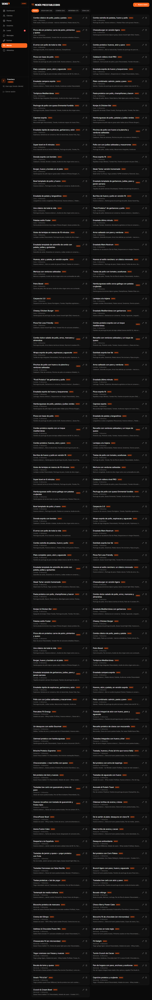

**Menús** — las plantillas del recetario que alimentan "Sugiéreme un menú". Cada una tiene
nombre, momento (desayuno/comida/merienda/cena) y una lista de alimentos con su rol
(proteína, hidrato o grasa) y su proporción. Al elegir un alimento del buscador se ven sus
macros por 100 g como guía. Los creados a mano llevan badge "nuevo".

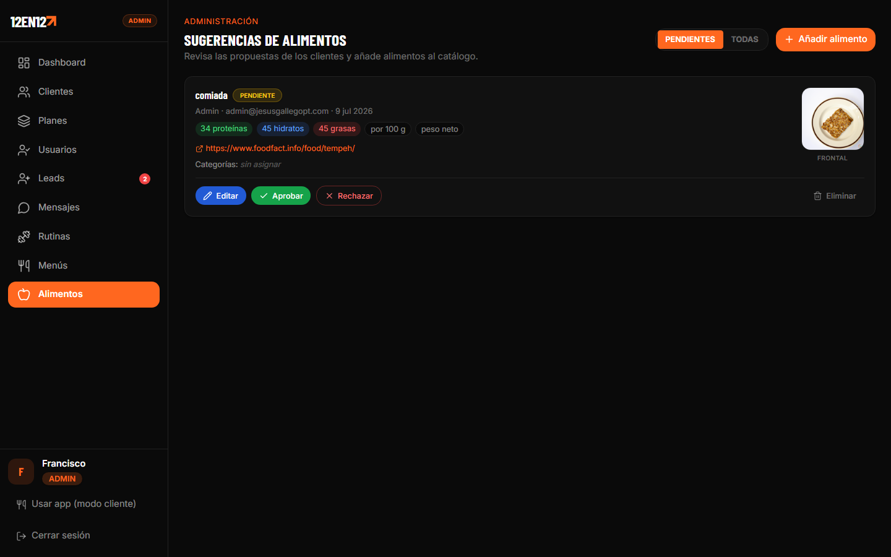

**Alimentos** — la moderación de lo que proponen los clientes. Cada sugerencia muestra los
datos propuestos, el cliente, las fotos (frente y reverso) y su estado. El admin puede
corregir, asignar categorías, aprobar (entra al catálogo y se avisa al cliente) o rechazar
con motivo. También se pueden dar de alta alimentos directamente.

> Si se aprueba sin asignar categorías, la app avisa: *"Sin categorías no aparecerá en los
> filtros del buscador."*

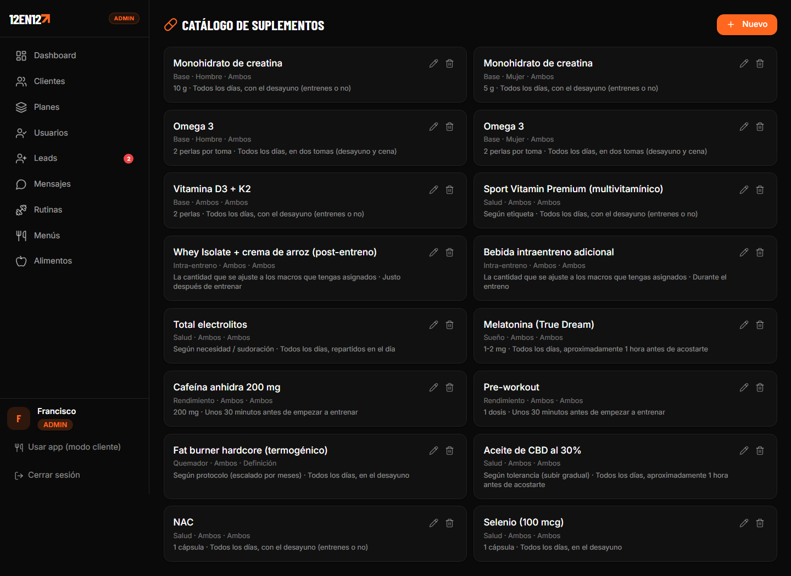

**Catálogo de suplementos** — título, sexo, categoría (base, intra, rendimiento, quemador,
salud, sueño, otro), objetivo, cuándo, cuánto, observaciones, imagen y enlaces de compra.
El borrado es lógico: se desactiva y se puede volver a activar.

## 2.8 Rutinas · `/admin/routines`

Vista general de quién tiene rutina y quién no, con filtro "solo sin rutina". Al pulsar una
fila se va a la ficha del cliente, que es donde se generan y editan.

---

# Parte 3 · Dónde se cruzan

## 3.1 Tabla de interacciones cliente ↔ equipo

| El cliente hace... | El equipo ve... | Dónde | Cuándo |
|---|---|---|---|
| Termina el test de nivel eligiendo Nivel 3 | Alerta **"Piden que les llamemos"** con su teléfono | Panel de control, arriba del todo | Al instante |
| Guarda su resultado del test | Un lead nuevo con la nota del nivel recomendado | Leads | Al instante |
| Entra por el formulario de GoHighLevel | Un lead nuevo (o reabierto si estaba descartado) | Leads + Notion | Al instante |
| Paga su plan | Cliente activo, con su lunes de arranque | Clientes | Al confirmarse el pago |
| Termina el cuestionario de ajuste **con plan con coach** | **Propuesta de macros pendiente** + aviso | Campana + ficha | Al instante |
| Termina el cuestionario **sin coach** | Nada: los macros se aplican solos | — | — |
| Declara una dieta que no cuadra con su % graso | Entrada en **"Macros por revisar"** | Panel de control | Al guardar |
| No tiene macros asignados | Columna **"Sin macros"** | Por hacer esta semana | Continuo |
| No manda su reporte | Columna **"Reporte pendiente"** (con "tarde" si se pasó) | Por hacer esta semana | Semanal |
| Manda un reporte | Fila "sin feedback" en su ficha | Ficha → Seguimiento | Al enviarlo |
| Sube fotos de progreso | Las ve en el comparador | Ficha → Seguimiento | Al instante |
| Hace un check-in | Se actualiza su semáforo | Ficha → Seguimiento | Al instante |
| Escribe por el chat | Conversación con contador de no leídos | Mensajes | Al instante |
| Sugiere un alimento | Sugerencia pendiente con sus fotos | Alimentos | Al instante |
| Compra una revisión suelta | Revisión pendiente + aviso a su coach (o a todo el equipo si no tiene) | Campana | Al pagar |
| Le falla el cobro | Alerta (crítica al segundo fallo) | Alertas | Al instante |
| Le falla el cobro 3 veces | **Baja automática** y suscripción cancelada | Alertas | Al tercer fallo |
| Llega a la semana 11 | — | — | El cliente ve su pantalla de renovación |

| El equipo hace... | El cliente recibe... |
|---|---|
| Guarda sus macros | Novedad *"Tu coach ha actualizado tus macros"* + el feedback escrito |
| Escribe feedback en un reporte | Novedad *"Tu coach ha comentado tu reporte"* + el texto en su informe |
| Escribe feedback en un check-in | Novedad *"Tu coach ha comentado tu check-in"* |
| Guarda una rutina | Novedad *"Tu coach te ha preparado una rutina nueva"* |
| Cambia sus suplementos | Novedad *"Tu protocolo de suplementos se ha actualizado"* + la nota |
| Le cambia el coach | Aviso del cambio |
| Aprueba su alimento sugerido | *"Tu alimento sugerido X ha sido aprobado y ya está en la calculadora"* |
| Rechaza su alimento | El aviso con el motivo |
| Edita un plan del catálogo | Su pantalla de "tu plan incluye" cambia sola |

## 3.2 Notificaciones, una por una

Hay dos clases, y conviven en la misma campana.

### Las que dispara una persona

Rutina nueva, cambio de macros, feedback, suplementos, cambio de coach, alimento aprobado o
rechazado. Se muestran **entre comillas**, porque las escribió alguien.

### Las que genera la app sola

Se evalúan cuando el cliente entra o abre la campana (no hay tareas programadas: un aviso
dentro de la app solo tiene sentido cuando alguien lo va a ver). Se muestran **sin
comillas**, para que no parezca que se lo dijo una persona.

**De calendario** — van siempre, no gastan cupo:

| Aviso | Cuándo |
|---|---|
| *"Tus macros son provisionales · Quince minutos y los tienes finos"* | 2 horas después del alta, si no ha afinado |
| *"Mañana empiezas · Tu rutina ya está cargada"* | El domingo antes del arranque |
| *"Tu próximo ajuste: en 6 días"* | Antes de la revisión de macros |
| *"Tu rutina acaba el {fecha} · Renuévala y sigue sin parar"* | 3 días antes |
| *"Tu ciclo acaba en una semana · Mira lo que has cambiado"* | Penúltima semana |

**Condicionadas** — solo si los datos lo justifican, y **como mucho una por semana**. Si en
la misma semana se cumplen tres condiciones, sale una: la más útil. Por orden de prioridad:

1. *"Sin fotos no podemos comparar"* — lo que más bloquea
2. *"Llevas N semanas con los mismos macros"* — la única redactada de forma directa, porque
   es la que mueve
3. *"¿Quieres que revisemos tu caso?"* — cuando está estancado
4. *"¿Te pesamos esta semana?"* — 7+ días sin registrar peso
5. *"¿Todo bien?"* — 5+ días sin montar dieta
6. *"Tu plan sigue aquí"* — 14+ días sin entrar. La más suave, y la última: el que lleva dos
   semanas sin aparecer no necesita que le recuerden lo que no ha hecho

**Todas están escritas desde el alivio, no desde la exigencia.** El cliente lleva años
oyendo que le falta fuerza de voluntad; si la app se suma a ese discurso, la desinstala.

---

# Parte 4 · Los motores

## 4.1 Cómo se calculan los macros

### La tabla base

No es una fórmula continua, es **la tabla de Jesús** (un Excel convertido a datos). Con el
peso, el sexo, el % de grasa y el objetivo se busca la fila exacta.

Los escalones: peso de 60 a 120 kg de 5 en 5 (hombre) o de 50 a 115 (mujer); grasa del 10
al 45 % (hombre) o del 20 al 50 % (mujer). Los valores intermedios se redondean al escalón
más cercano y los extremos se pegan al tope.

Cada fila da los 8 números: proteína, hidratos y grasa de **entreno**; proteína e hidratos
de **perientreno**; proteína, hidratos y grasa de **descanso**.

**Un detalle revelador**: entre volumen y definición, para el mismo peso y grasa, la
proteína y la grasa **son iguales**. Lo único que cambia son los hidratos.

### Los modificadores del quiz

Se aplican **solo a los hidratos** de entreno y descanso (nunca al perientreno ni a la
proteína), y **se suman** entre sí, no se multiplican:

| Respuesta | Efecto |
|---|---|
| Muy activo fuera del gimnasio | **+10 %** en entreno y descanso |
| Practica otro deporte | **+20 %** en descanso si está en volumen, **+10 %** si en definición |
| "Casi no engordo" o "engordo lo normal", **y menos del 20 % de grasa** | **+20 %** en entreno y descanso |
| **"Engordo enseguida"** | **VETO**: anula todas las subidas anteriores |

Topes: +30 % como máximo en entreno, +40 % en descanso.

**Regla dura**: el hidrato de descanso nunca puede superar al de entreno. Si al aplicar los
modificadores se pasa, **se sube el entreno** hasta igualarlo — nunca se baja el descanso,
porque su subida tiene un motivo real (el deporte de ese día).

### La dieta que ya come

Si declara lo que come y **lo confirma**, ese dato manda por encima de todo lo demás. Una
matriz decide qué hacer según su objetivo y cómo le está funcionando: respetar lo que come,
recortarle un poco, o volver a la tabla.

Casos especiales: en definición con menos de 75 g de hidratos, se le da un arranque mínimo
fijo (llega "en las últimas"). La grasa se fija por tramos según la que trae.

### Suelos

La última red: proteína de entreno mínimo 160 g (hombre) o 120 (mujer); hidratos de comidas
en entreno mínimo 60 g; hidratos de descanso mínimo 50 g; grasa mínimo 50 g.

Todo se redondea al múltiplo de 5 más cercano, siempre como último paso.

### El orden exacto en que se aplica todo

El orden importa: cambiarlo cambia el resultado. El motor hace siempre estos seis pasos, y
ninguno se salta:

| | Paso | Qué toca |
|---|---|---|
| 0 | **Tabla base** | Los 8 números de partida, buscados por peso, sexo, grasa y objetivo |
| 1 | **Modificadores del quiz** | Solo hidratos de entreno y descanso. Se suman, luego topes (+30 % / +40 %) y veto |
| 2 | **Excepción de fármacos** | +10 % de proteína **solo en descanso** |
| 3 | **Dieta declarada** | Pisa los hidratos si la confirmó. La proteína sigue siendo la de tabla |
| 4 | **Suelos** | Los mínimos, uno por uno |
| 5 | **Redondeo a múltiplo de 5** | Siempre el último. Redondear antes arrastraría el error por todos los pasos |

Dos avisos sobre el paso 2: la regla de fármacos **está escrita pero no se aplica**. El
motor la reconoce, la deja anotada y sigue sin tocarla, a la espera de que Jesús confirme
la regla. Y quien marca esa casilla es el coach o el Nivel 1, nunca el cliente.

Cada paso deja su rastro en un **desglose** que se guarda junto a los macros: qué se
aplicó, qué no y por qué. Es lo que permite explicar después de dónde sale cada número en
vez de enseñar un resultado sin origen.

Los **multiplicadores por masa de trabajo** se calculan aparte, sobre los macros ya
terminados, no en mitad del cálculo.

### El ajuste mensual (el agente)

Es cosa distinta del cálculo inicial. Un agente de IA propone hacia dónde mover los macros
de un cliente que ya lleva tiempo, mirando: sus macros actuales, su fase y meses en ella, su
margen (si aguanta más hambre o no), la evolución del peso **en porcentaje**, su reporte, su
**historial completo de ajustes con el criterio del coach y cómo salió cada fase**, su
perfil (motor × respondedor) y **casos parecidos de otros clientes**.

Sus reglas duras:
- **La proteína no se toca** en un ajuste normal (se mantiene el 78 % de las veces)
- **El hidrato de entreno manda** y arrastra al resto
- **El intra acompaña al hidrato de entreno**, por tramos
- **Descanso siempre por debajo de entreno**; la grasa de entreno nunca por encima de la de
  descanso
- **La grasa nunca baja de 40 g**. En el punto más bajo no se aguanta más de un mes
- **Escalones reales**: 10, 15, 20, 25, 30, 40, 50 o 60 g. El de 20 es el más común. Nunca
  progresiones lineales. Cuanto más arriba, pasos más pequeños
- **El techo y el suelo son de cada persona**, salen de su historial, no hay topes generales

Si no cumplió, **no se toca nada**: el ajuste es que cumpla lo que ya tiene.

Un **guardarraíl determinista** revisa la propuesta y avisa (no bloquea). Si los macros
actuales ya venían rotos, lo dice: *"Ya venía así: no lo empeora este ajuste"*.

**Decide el coach**, siempre. Y si corrige la propuesta, esa corrección queda registrada.

## 4.2 Cómo se cuentan los alimentos

Aquí está la diferencia con cualquier contador de calorías.

### Macros de etiqueta frente a macros efectivos

- **De etiqueta**: lo que dice el envase
- **Efectivos**: lo que cuenta

### La regla del 25 %

Un macro solo cuenta si aporta **al menos una cuarta parte** de lo que aporta el macro
dominante de ese alimento. Más excepciones por categoría con umbrales fijos.

Ejemplos:
- **Huevos y carnes**: la proteína siempre; los hidratos si pasan de 2 g/100 g; la grasa si
  llega a 3 g
- **Cereales y panes**: los hidratos siempre; la proteína **solo si supera un tercio de los
  hidratos**
- **Tubérculos y frutas**: solo hidratos. La proteína y la grasa **nunca**
- **Verduras**: la proteína nunca; hidratos y grasa solo por encima de 4 g/100 g
- **Aceites, mantequilla, aguacate**: solo grasa, siempre
- **Frutos secos**: la grasa siempre; proteína e hidratos solo si superan un tercio de la
  grasa

### La calibración progresiva

Una regla añadida el 17-07-2026 que no estaba en las reglas fijas: la proteína de
**cereales y panes** (acumulado conjunto) y la de **frutos secos** (acumulado propio) cuenta
al 0 %, 50 % o 100 % **según cuánto lleve acumulado ese día**:

| | 0 % | 50 % | 100 % |
|---|---|---|---|
| Cereales y panes | 0-50 g | 50-100 g | +100 g |
| Frutos secos | 0-20 g | 20-40 g | +40 g |

Las comidas se recorren en orden cronológico y **cada comida cae entera en un tramo**. Por
eso editar una comida solo recalcula esa y las posteriores, nunca las anteriores.

Los cereales y panes proteicos van siempre al 100 %, sin calibrar.

### Cómo se escala

- **A granel**: los valores del catálogo son por 100 g
- **Por unidades**: son por unidad entera, y la ración dice cuánto pesa una

Al cambiar la cantidad con los −/+, el escalado se hace **en el navegador, sin llamar al
servidor**, sobre los macros efectivos (no sobre los crudos). Es matemáticamente
equivalente porque el método es lineal con la cantidad: las reglas deciden **qué** cuenta,
no **cuánto**.

## 4.3 El reparto entre comidas

Los macros del día son un presupuesto; el reparto decide cuánto va a cada comida. **El
cliente no reparte nada a mano**: elige cuatro cosas en la configuración del día y el
reparto sale solo.

| Lo que elige | Opciones |
|---|---|
| Tipo de día | Entreno / Descanso |
| Número de comidas | Comida única / 3 / 4 |
| Horario de entreno | En ayunas / Tras Comida 1 / Tras Comida 2 / Tras Comida 3 |
| Perientreno | Intra + Post / Solo Post / Solo Intra / Sin perientreno |

Las tres últimas solo aparecen en día de entreno, y el horario y el perientreno desaparecen
en comida única (no hay nada que colocar).

### Los tres casos que no usan tablas

- **Día de descanso**: reparto **equitativo** entre las comidas que tenga. Sin perientreno,
  porque no hay entreno alrededor del que colocarlo.
- **Comida única**: esa comida se lleva **todo** el presupuesto del día. En día de entreno,
  el perientreno sigue calculándose aparte.
- **3 comidas**: un tercio exacto a cada una, también en día de entreno. Los escenarios de
  hidratos **no se aplican**: son cosa de los días de 4 comidas.

### Día de entrenamiento con 4 comidas

Aquí sí hay tablas, y lo que decide cuál se usa son **los hidratos del día**:

| Hidratos de entreno | Escenario | Cómo reparte los hidratos |
|---|---|---|
| Más de 150 g | 1 | Porcentajes fijos por comida |
| 100-150 g | 2 | Porcentajes fijos, pero concentrados alrededor del entreno |
| 50-100 g | 3 | 10 g + 10 g a las dos comidas más lejos del entreno; el resto a medias entre las dos más cerca |
| Menos de 50 g | 4 | Casi todo a la comida de después de entrenar |

La proteína y la grasa usan **siempre** los porcentajes del escenario 1, sea cual sea el
escenario. Lo único que cambia de un escenario a otro son los hidratos.

**Escenario 1 (más de 150 g de hidratos)** · porcentaje de P / H / G por comida:

| Entrena | Comida 1 | Comida 2 | Comida 3 | Comida 4 |
|---|---|---|---|---|
| En ayunas | 25 / 30 / 20 | 25 / 20 / 25 | 20 / 20 / 25 | 30 / 30 / 30 |
| Tras C1 | 25 / 30 / 20 | 25 / 30 / 20 | 20 / 20 / 30 | 30 / 20 / 30 |
| Tras C2 | 25 / 20 / 30 | 20 / 30 / 20 | 25 / 30 / 20 | 30 / 20 / 30 |
| Tras C3 | 30 / 20 / 30 | 25 / 20 / 30 | 20 / 30 / 20 | 25 / 30 / 20 |

**Escenario 2 (100-150 g)** · mismos P y G, hidratos más apretados:

| Entrena | Comida 1 | Comida 2 | Comida 3 | Comida 4 |
|---|---|---|---|---|
| En ayunas | 25 / 36 / 20 | 25 / 18 / 25 | 20 / 10 / 25 | 30 / 36 / 30 |
| Tras C1 | 25 / 36 / 20 | 25 / 36 / 20 | 20 / 18 / 30 | 30 / 10 / 30 |
| Tras C2 | 25 / 18 / 30 | 20 / 36 / 20 | 25 / 36 / 20 | 30 / 10 / 30 |
| Tras C3 | 30 / 10 / 30 | 25 / 18 / 30 | 20 / 36 / 20 | 25 / 36 / 20 |

Se lee en horizontal: con menos hidratos, las dos comidas pegadas al entreno pasan de 30 %
a 36 % y la más lejana cae a 10 %. Cuanto menos hidrato hay, más se concentra donde sirve.

**Escenario 3 (50-100 g)**: se apartan 20 g y se dan de 10 en 10 a las dos comidas más
lejos del entreno. Los otros 30-80 g se parten a medias entre las dos más cerca. Ejemplo
con 70 g entrenando tras la Comida 1: C1 y C2 se llevan 25 g cada una, C3 y C4 se quedan
con 10 g.

**Escenario 4 (menos de 50 g)**: manda la comida de después de entrenar.

- Menos de 30 g: **todo** ahí, y las otras tres a cero.
- Entre 30 y 50 g: la de después se lleva todo menos 10 g, y esos 10 g van a la comida
  anterior al entreno. Las otras dos, a cero.

Una comida a cero hidratos no es un fallo: es la consecuencia de tener pocos que repartir.

### El perientreno

Sale del presupuesto de perientreno, no del de las comidas. Cuatro modos:

| Modo | Intra | Post | El resto |
|---|---|---|---|
| **Intra + Post** | 20 % P · 30 % H | 80 % P · 70 % H | — |
| **Solo Post** | — | 100 % P · 100 % H | — |
| **Solo Intra** | 25 % P · 35 % H | — | El 75 % P y el 65 % H que sobran se reparten a partes iguales entre las comidas |
| **Sin perientreno** | — | — | Todo el presupuesto se reparte a partes iguales entre las comidas |

Los dos primeros vienen del método original. Los dos últimos son nuestros.

En "Solo Intra" el intra se lleva su parte normal **más 5 puntos** (del 20 al 25 en
proteína, del 30 al 35 en hidratos): entrenar con eso dentro pesa más que repartirlo.

**El intra y el post nunca llevan grasa.** No es un olvido: el perientreno solo tiene
presupuesto de proteína e hidratos.

Un detalle que explica un caso raro: si el cliente **no tiene perientreno configurado**
(campo vacío, no un cero puesto a mano), se le da un arranque de **35 g de proteína y 15 g
de hidratos** para que el perientreno no salga vacío. Si el coach ha puesto un cero a
propósito, ese cero se respeta.

### El redondeo

Cada macro de cada comida se redondea **a 0,5 g**, y solo ahí. El total del día no se
redondea antes de repartir: hacerlo movía el objetivo de la comida lo justo para que el
sugeridor propusiera cantidades distintas (47 g en vez de 46,8 cambiaba la cantidad
propuesta de un alimento a granel en varios gramos).

## 4.4 Cómo la app busca y elige alimentos

Buscar un alimento parece lo más simple de la app y es de lo que más reglas tiene detrás.
Hay **cuatro buscadores distintos** trabajando sobre el mismo catálogo: el buscador de
texto, el sugeridor por macros, el asistente de IA y los dos pickers de menús.

### El catálogo

**3.211 alimentos.** Cada uno lleva una o varias **categorías numeradas** (la 1 son huevos,
la 2 carnes, la 3 pescados, la 8 panes, la 13 verduras, la 17 grasas...), y esa numeración
es la que gobierna casi todo: qué macros cuentan, dónde se puede usar el alimento y de
cuánto en cuánto se mueve su cantidad.

- **2.736 son de marca** (tienen enlace a la ficha del producto); el resto son genéricos.
- **1.131 se cuentan por unidades** (huevos, yogures, lonchas, piezas de fruta); los demás,
  a granel.
- Tres etiquetas que se ven en pantalla: **GEN** (genérico), **PRO** (marca recomendada con
  descuento) y **FRE** (frescos).

### El buscador de texto

Es el de Nutrición y el de la pestaña Alimentos. Funciona así:

1. Se normaliza lo escrito: **sin acentos y sin mayúsculas**. "atún", "Atun" y "ATÚN" son lo
   mismo.
2. Se parte en palabras y **todas tienen que aparecer** en el nombre del alimento, en
   cualquier orden y en cualquier posición. Por eso "arroz integral" encuentra "Arroz blanco
   integral": no busca la frase entera seguida.
3. **No reordena por relevancia.** El orden que ves es el del catálogo, no un ranking de
   parecido. Es a propósito: el buscador de la dieta enseña lo que hay, y quien ordena por
   lo que te cuadra es el sugeridor, que es otra cosa.
4. Hacen falta **dos letras** para que empiece a filtrar.

Encima de eso se aplican los filtros que toquen: por categoría, por etiqueta, y los que
dependen del contexto.

### Los filtros que no se ven

- **Intra**: solo aminoácidos e intraentrenamiento (categorías 41 y 18).
- **Post**: proteínas en polvo, lácteos, cereales, panes, fruta, tortas de arroz, bebidas
  vegetales, azúcares, postres y salsas (12 categorías). Lo demás no aparece.
- **Cuadrar grasas al final**: aceites y grasas de buena calidad (17.1 y 42).
- **Vegano**: fuera huevos, carnes, pescados, proteínas de suero y lácteos.
- **Alimentos evitados**: lo que el cliente marcó en sus preferencias se cae de las
  sugerencias y de los menús, no solo del buscador.

### El sugeridor por macros

Cuando pides que la app te proponga alimentos, la regla es una sola frase: **calcula cuánto
cabe de cada alimento sin pasarse y los ordena por lo que aportan**.

En detalle, el orden de la lista sale de tres criterios seguidos:

1. Primero **los que caben** (no se pasan de ningún macro que te quede).
2. Entre esos, **los que más macros aportan**.
3. A igualdad, **la marca recomendada por delante**.

Con dos excepciones. Si estás montando la comida por pasos, el paso de proteína ofrece
**solo fuentes proteicas puras** (huevos, carnes, pescados, proteína en polvo, lácteos, soja
y proteína vegetal); el de acompañamiento, todo. Y si ya tienes la proteína y los hidratos
cuadrados (±4 g) y **solo te falta grasa**, la lista pone delante los aceites y las grasas
buenas, porque es lo que cierra una comida sin descuadrar el resto.

### Cuánta cantidad propone

La regla es **el macro más limitante**. Se calcula cuánto cabría de ese alimento según cada
macro por separado y se coge la cantidad más pequeña: si un alimento llega antes al tope de
grasa que al de proteína, se para en la grasa aunque la proteína se quede corta. Nunca se
pasa para "aprovechar".

Y siempre sobre los **macros efectivos**, no sobre los de la etiqueta. Un alimento cuya
proteína no cuenta (ver 4.2) no sirve para cubrir proteína, por mucha que ponga el envase.

### Los redondeos de cantidad

La cantidad propuesta se redondea **hacia abajo**, para no pasarse, y en escalones que
dependen de la categoría:

| Alimento | Escalón |
|---|---|
| Panes (cat. 8) | 10 g |
| Carnes, pescados, tubérculos, verduras, arroces, pastas (2, 3, 9, 13, 21, 22) | 25 g |
| Huevos enteros (1.2) | 55 g, que es más o menos un huevo |
| Claras de huevo (1.1) | 1 g |

Los botones **−/+** de la pantalla usan otros pasos, pensados para la mano y no para el
cálculo: **una unidad entera** en los alimentos por unidades, **50 g** en verduras y bebidas
vegetales, **5 g** en salsas zero y **1 g** en todo lo demás. Y al mover la cantidad, el
recálculo se hace **en el navegador, sin llamar al servidor**.

### El asistente de IA

La gente no escribe como está el catálogo. El asistente traduce, en este orden:

1. **Busca literalmente lo que has escrito.** Si sale algo bueno, se queda con eso. Lo que
   escribe el usuario manda.
2. Si no sale nada (o sale un parecido flojo), **prueba con la traducción** que ha hecho el
   modelo: "tostadas" acaba en "pan tostado".
3. Y cuando usa la traducción, **lo dice**, en vez de colar un alimento con otro nombre en
   silencio.

Además hay una lista de equivalencias fijas, escrita a mano, para lo que se repite: typos
("wevos", "abena", "keso"), regionalismos ("palta", "frutilla", "durazno") y alimentos que
sin cocinar no significan lo mismo ("garbanzos" → "garbanzos cocidos"). Esas equivalencias
solo se aplican cuando la consulta es **de una sola palabra con contenido**: si no, "leche
de avena" acabaría en leche de vaca porque la palabra "leche" secuestra la búsqueda.

Cuando lo que pides es ambiguo y de una sola palabra ("pavo", "lomo"), no elige por ti:
**ofrece las opciones numeradas** en el chat, con el mismo orden que usaría la calculadora,
y tú respondes con el número.

### Los dos pickers de menús

"Sugiéreme un menú" abre un modal con dos pestañas, y cada una busca de una manera distinta:

- **Biblioteca**: 266.170 comidas reales de clientes, ya cuadradas con el método. Busca por
  **cercanía** a tu objetivo (con el margen que tú muevas, ±2 a ±10 g) y ajusta el menú con
  sus **palancas**: el alimento que manda en cada macro puede moverse hasta ±20 g de
  proteína, ±30 de hidratos y ±8 de grasa sin descuadrar lo demás. Los alimentos por
  unidades nunca hacen de palanca: no se parten medios huevos.
- **Recetario**: las 99 recetas de la membresía ELM. Aquí no hay cantidades cerradas; al
  elegir una, **el motor la cuadra a tus macros** partiendo del mínimo de cada ingrediente y
  subiendo hasta llegar.

El botón **Cuadrar** de una comida usa el mismo afinado que los menús: prueba a mover cada
alimento un escalón arriba o abajo y, si con un solo movimiento no mejora, prueba
**intercambios** de dos (menos huevo y más pescado blanco recorta grasa sin perder
proteína). Se queda con la combinación que menos se aleja del objetivo.

## 4.5 Cobros con Stripe

### El guardarraíl de modo

La app mira el prefijo de la clave: `sk_test_` o `sk_live_`. **Aunque alguien ponga por
error una clave real en un entorno de pruebas, la app se niega a cobrar** salvo que además
se active explícitamente el modo live. Es una segunda llave.

### Eventos que escucha

| Evento | Qué hace |
|---|---|
| Checkout completado | Marca el checkout, activa la suscripción o el pago único |
| Suscripción creada / actualizada / borrada | Sincroniza el estado real |
| Factura pagada | Registra el pago, activa el perfil, limpia fallos y resuelve alertas |
| Factura fallida | Registra el fallo y **cuenta**: al tercero, baja automática y cancelación |

**Idempotencia**: cada evento se reclama **antes** de procesarlo. Si el procesado falla a
medias, se libera para que el reintento de Stripe lo haga limpio, en vez de quedar
"medio procesado" pero marcado como hecho.

### La revisión suelta

Un cliente de Nivel 1 puede pagar **147 €** por una revisión de sus macros sin cambiar de
plan. Se rechaza si su plan ya incluye entrenador o si ya tiene una pendiente.

Al pagarla se crea una revisión pendiente y **se avisa a su coach; si no tiene, a todo el
equipo** — es mejor eso que dejarla esperando a una asignación que quizá no llega.

**Si en los 30 días siguientes sube de plan, se le descuenta** lo pagado con un cupón por el
importe exacto. Si la creación del cupón falla, el alta sigue igual (no se bloquea la
compra).

Nunca cambia su plan ni su estado: es puramente operativa.

## 4.6 El PDF

Se pide desde el botón "PDF" de la pestaña de Nutrición. **Antes de generarlo se fuerza un
guardado**: el PDF se hace en el servidor a partir de la dieta guardada, nunca de lo que hay
en pantalla sin guardar.

El documento, generado con ReportLab en A4:

1. **Banda naranja de marca** con "12EN12 · Método 12en12" y la fecha en
   formato largo ("20 de julio de 2026")
2. **Cliente** y un badge **"DÍA DE ENTRENAMIENTO"** o **"DÍA DE DESCANSO"**
3. **Tres tarjetas** con los macros del día y su objetivo
4. **Cada comida**: cabecera tipo píldora con su nombre y su resumen, y una tabla de
   Alimento / Cantidad / Aporta. La cantidad respeta las unidades (*"2 ud (126 g)"*), y
   "Aporta" lista **todos** los macros que cuentan, de mayor a menor
5. Bajo cada comida: *"✓ Cuadra con el objetivo"* en verde, o el objetivo con las
   diferencias en ámbar
6. **Balance del día**: objetivo, consumido y diferencia con signo
7. Pie con la fecha de generación

El objetivo se recalcula con **los macros que estaban vigentes esa fecha**, no con los
actuales.

---

# Parte 5 · Lo que conviene saber

## 5.1 Funcionalidad apagada a propósito

| Qué | Desde | Por qué |
|---|---|---|
| **La rutina, en el cliente** | 19-07-2026 | Hasta completar la funcionalidad. El panel del coach sigue activo |
| **Favoritos de alimento (la estrella)** | 06-07-2026 | La estrella alteraba el orden del buscador y no se quería |
| **La biblioteca de clientes en las sugerencias del cliente** | 12-07-2026 | El cliente solo ve el recetario |
| **"Mejorar mi plan" en el perfil** | 06-07-2026 | El checkout de mejora no existía entonces |
| **La tarjeta de cadencia de reportes del panel** | 20-07-2026 | A la espera de mejorar el panel |
| **El modificador de "engordo" en mujeres** | — | Sin validar (solo 11 casos) |
| **La excepción de proteína por farmacología** | — | Pendiente de que Jesús confirme la regla |

## 5.2 Huecos reales

**No hay registro de entrenamientos.** La app guarda el **plan** de rutina, no las sesiones
hechas. El único sitio donde constaba era la pregunta "¿entrenaste hoy?" del check-in
diario, que se quitó al reducirlo a dos campos. Consecuencia: el conteo de entrenos del
informe se queda sin fuente hasta que exista un registro de sesiones. La confirmación de
huecos hace de sustituto preguntándolo en el reporte.

*No se rellenó por las bravas dando por entrenado el día que tocaba: contaría entrenos que
nadie ha hecho.*

**El cliente no puede darse de baja desde la app.** El backend tiene el endpoint del portal
de Stripe (donde se cambia la tarjeta o se cancela), pero **ninguna pantalla lo llama**. Hoy
hay que pedirlo por otra vía.

**La evolución de referencia casi no se ve.** Necesita sexo y objetivo, y solo 20 de 182
perfiles tienen ambos. Además el campo de sexo mezcla "male" y "hombre" (ya se tolera al
comparar, pero convendría unificarlo).

**El plan elegido en el test se pierde.** Quien hace el test y elige "Nivel 2" llega a la
pantalla de planes sin nada preseleccionado y tiene que volver a elegir.

**El webhook de GoHighLevel depende de que el secreto esté configurado.** El código lo
soporta; si la variable no está puesta en el entorno, el endpoint queda abierto.

**La vista del coach de los check-ins diarios no se actualizó** tras el recorte a dos
campos: sigue leyendo el ánimo y el "entrenó" sin comprobar si existen, así que los
check-ins nuevos pueden verse como "No entrenó" cuando en realidad no se preguntó.

**Precios desactualizados al convertir un lead**: la conversión manual usa unos importes
fijos que ya no coinciden con el catálogo. Como no pasa por Stripe, es solo informativo.

## 5.3 Cosas que confunden

**Calcular y aplicar pueden dar números distintos.** `/targets` calcula con lo que se está
tecleando ahora; `/targets/apply` usa los ajustes **ya guardados** del perfil. Y no es un
fallo: aplicar usa los modificadores del cliente. Si el demo declara una dieta de 250 g de
hidratos, calcular sin modificadores da 170 y aplicar da 205. **Calcular sin modificadores
da la tabla; aplicar da lo que le toca a él.**

**Hay tres caminos para guardar macros**: el cliente desde su calculadora, el coach desde la
ficha, y un tercero que aplica directo. Solo los dos primeros dejan rastro en el historial.

**"Sugiéreme un menú" son dos sistemas distintos**: el cliente ve la **biblioteca real**
(266.000 comidas de clientes, con palancas de ajuste); el coach puede además buscar en el
**recetario** de plantillas.

**Los macros de una dieta pasada no cambian** aunque hoy tenga otros: cada día usa los que
estaban vigentes en su fecha.

**El interruptor Método/Reales no afecta a nada** más que a la línea de cada alimento.

---

# Anexo A · Mapa de rutas

### Públicas
| Ruta | Qué es |
|---|---|
| `/test` | El test de nivel. **Sin sesión** |
| `/auth` | Entrar y registrarse |

### Cliente
| Ruta | Qué es | Requiere |
|---|---|---|
| `/questionnaire` | El cuestionario (4 flujos) | Sesión |
| `/welcome` | Bienvenida | Sesión |
| `/planes` | Elegir plan | Sesión |
| `/onboarding` | **Redirige a `/planes`** | Sesión |
| `/renovacion` | Renovación de la semana 12 | Sesión |
| `/dashboard` | El panel | Sesión |
| `/dashboard/nutrition` | Nutrición | Sesión |
| `/dashboard/chatbot` | Asistente IA | Sesión |
| `/dashboard/foods` | Buscador de alimentos | Sesión |
| `/dashboard/macro-calculator` | Ajustar macros | Sesión |
| `/dashboard/reports` | Reportes | Plan con reportes |
| `/dashboard/checkins` | Check-ins | Plan con reportes |
| `/dashboard/supplements` | Suplementos | Plan con suplementación |
| `/dashboard/routine` | Rutina | **Oculta hoy** |
| `/dashboard/messages` | Chat | Sesión |
| `/dashboard/profile` | Mi perfil | Sesión |

### Equipo
| Ruta | Qué es | Requiere |
|---|---|---|
| `/admin` | Panel de control | Admin o trainer |
| `/admin/clients` | Listado de clientes | Admin o trainer |
| `/admin/clients/{id}` | Ficha (9 pestañas) | Admin o trainer |
| `/admin/leads` | CRM | Admin o trainer |
| `/admin/messages` | Bandeja | Admin o trainer |
| `/admin/planes` | Catálogo de planes | Admin o trainer |
| `/admin/routines` | Estado de rutinas | Admin o trainer |
| `/admin/menus` | Plantillas de menú | Admin o trainer |
| `/admin/alimentos` | Sugerencias de alimentos | Admin o trainer |
| `/admin/supplements-catalog` | Catálogo de suplementos | Admin o trainer |
| `/admin/usuarios` | Equipo y auditoría | **Solo admin** |

### La API

194 endpoints en 19 routers: `admin` (34), `calculator` (29), `users` (21), `chatbot` (14),
`leads` (13), `diets` (12), `checkins` (11), `billing` (11), `supplements` (7), `reports`
(7), `plans` (7), `messages` (6), `routines` (5), `menu_templates` (5), `auth` (5),
`notifications` (3), `report_cadence` (2), `payments` (1) y `audit` (1).

---

# Anexo B · Índice de capturas

Todas en `capturas/`, tomadas de la app funcionando.

### Sin sesión
- `00-entrar.png` — Entrar y registrarse
- `00-test-de-nivel.png` — El test de nivel

### Cliente (escritorio, 1440x900)
- `01-panel.png` — El panel
- `02a-nutricion-primera-dieta.png` — La pantalla de bienvenida a la primera dieta
- `02b-nutricion-pantalla.png` — Nutrición
- `02c-nutricion-vista-pestanas.png` — Vista de pestañas
- `02d-nutricion-vista-todo-seguido.png` — Vista todo seguido
- `02e-nutricion-constructor-comida.png` — El constructor de comida
- `02f-nutricion-calendario.png` — El calendario del mes
- `03-asistente-ia.png` — El asistente
- `03a-asistente-configurando.png` — El asistente configurando el día
- `04-rutina-OCULTA-redirige-al-panel.png` — **Prueba de que la rutina está oculta**
- `05-reportes.png` — Reportes
- `06-check-ins.png` — Check-ins
- `07-suplementos.png` — Suplementos
- `08-ajustar-macros.png` / `08a-ajustar-macros-detalle.png` — Ajustar macros
- `09-alimentos.png` — Buscador de alimentos
- `10-mensajes.png` — Chat
- `11-mi-perfil.png` — Mi perfil
- `12-planes.png` — Elegir plan
- `13-renovacion.png` — Renovación

### Equipo
- `20-admin-panel.png` — Panel de control
- `21-admin-clientes.png` — Clientes
- `22-admin-leads.png` — Leads
- `23-admin-mensajes.png` — Mensajes
- `24-admin-rutinas.png` — Rutinas
- `25-admin-suplementos.png` — Catálogo de suplementos
- `26-admin-menus.png` — Menús
- `27-admin-alimentos.png` — Alimentos sugeridos
- `28-admin-usuarios.png` — Usuarios
- `29-admin-planes.png` — Planes
- `30-admin-ficha-cliente.png` — La ficha de un cliente

### Móvil (390x844, viewport real)
- `40-movil-panel.png` — El panel
- `41-movil-nutricion.png` — Nutrición
- `42-movil-asistente.png` — El asistente
- `43-movil-reportes.png` — Reportes
- `44-movil-planes.png` — Planes
- `45-movil-test-de-nivel.png` — El test de nivel

---

*Documento generado el 3 de agosto de 2026 a partir del código fuente. Si algo de la app
cambia, este documento no se entera solo: hay que volver a pasarlo.*
